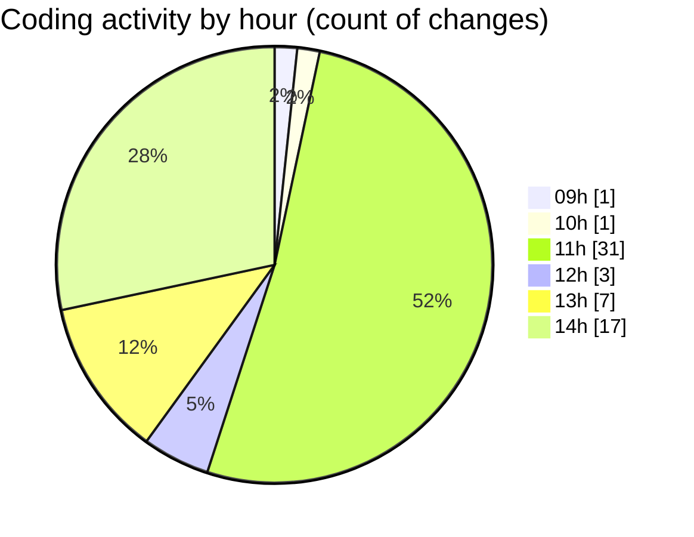

# cda - Activity Summary 

## Overall Statistics

| Stat                   | Value                                                             |
| ---------------------- | ----------------------------------------------------------------- |
| **Lines Added** (➕)   | 2783                                          |
| **Lines Removed** (➖) | 1358                                        |
| **Net Change** (↕)    | 1425                |
| **Active Time** (⌚)   | 90 minutes |

## Modified Files
- **.env** (+53, -0)
- **EventForm.tsx** (+2467, -1244)
- **stripOwner.ts** (+59, -49)
- **mapEventToForm.ts** (+133, -65)
- **settings.json** (+71, -0)

## Visualizations

### By File Type (Lines Changed)

### By Hour (Estimated Activity Count)

> **Last Updated:** 28/01/2026, 14:28:43