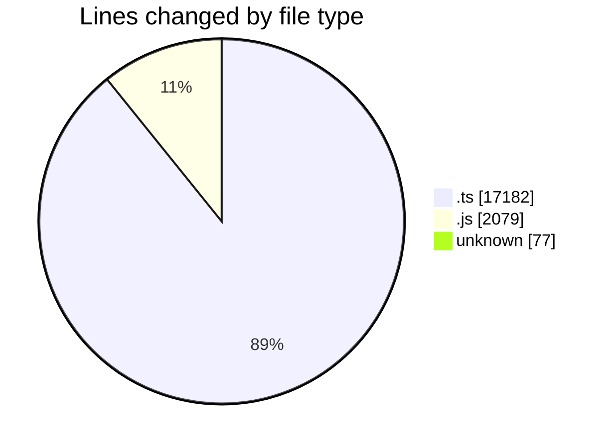
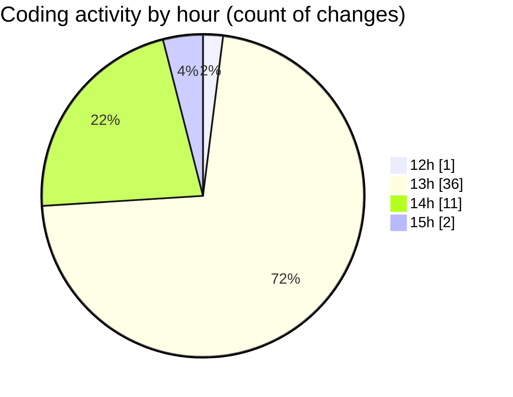

# cda - Activity Summary 

## Overall Statistics

| Stat                   | Value                                                             |
| ---------------------- | ----------------------------------------------------------------- |
| **Lines Added** (➕)   | 18485                                          |
| **Lines Removed** (➖) | 853                                        |
| **Net Change** (↕)    | 17632                |
| **Active Time** (⌚)   | 90 minutes |

## Modified Files
- **sap_views.ts** (+1321, -0)
- **peopleview.js** (+396, -12)
- **profile.js** (+242, -7)
- **peopleview.js** (+298, -4)
- **resolvers-types.ts** (+15055, -806)
- **.env** (+77, -0)
- **PeopleViewRepository.js** (+130, -0)
- **profile.js** (+249, -14)
- **peopleview-queries.js** (+717, -10)

## Visualizations

### By File Type (Lines Changed)

### By Hour (Estimated Activity Count)

> **Last Updated:** 03/02/2026, 15:03:48