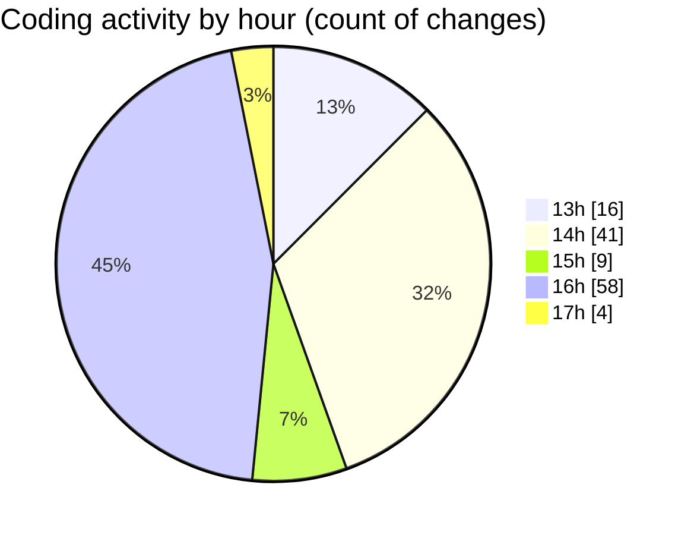

# cda - Activity Summary 

## Overall Statistics

| Stat                   | Value                                                             |
| ---------------------- | ----------------------------------------------------------------- |
| **Lines Added** (➕)   | 5459                                          |
| **Lines Removed** (➖) | 2886                                        |
| **Net Change** (↕)    | 2573                |
| **Active Time** (⌚)   | 199 minutes |

## Modified Files
- **peopleview-queries.js** (+1067, -317)
- **Profile.types.ts** (+332, -26)
- **queries.ts** (+1791, -1024)
- **mutations.ts** (+23, -0)
- **App.tsx** (+105, -0)
- **settings.json** (+71, -0)
- **queries.ts** (+1522, -1504)
- **UsefulNumbers.tsx** (+106, -3)
- **ConstructDefinitionListItem.tsx** (+78, -2)
- **fieldUtils.ts** (+198, -1)
- **ConstructFieldContent.tsx** (+56, -8)
- **ProfileFields.types.ts** (+110, -1)

## Visualizations

### By File Type (Lines Changed)

### By Hour (Estimated Activity Count)

> **Last Updated:** 04/02/2026, 17:02:12