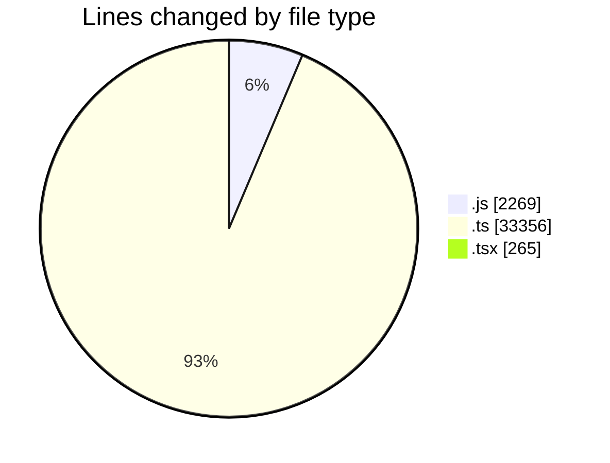
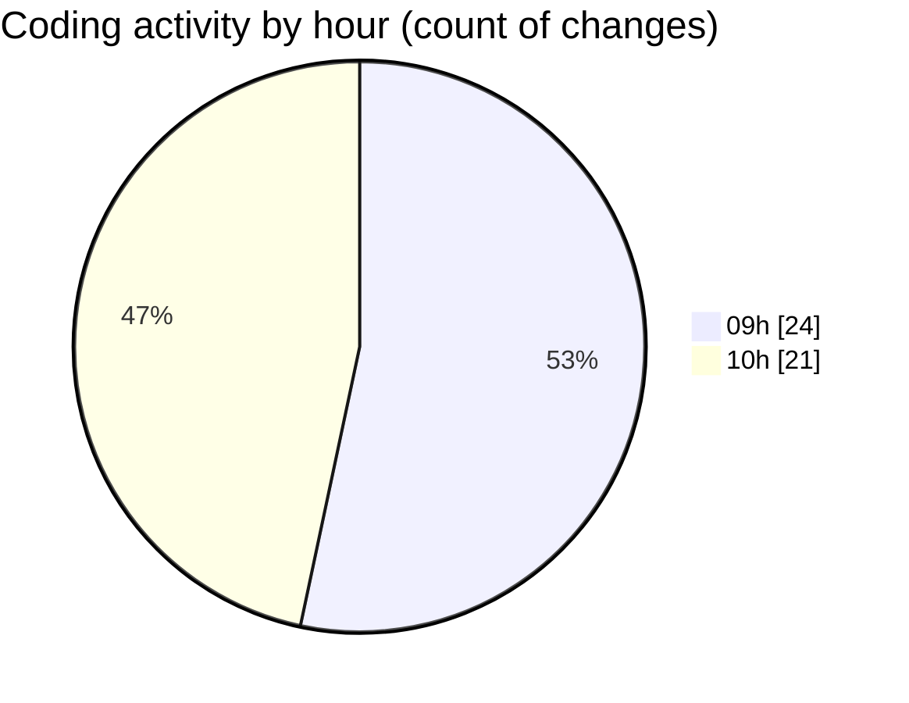

# cda - Activity Summary 

## Overall Statistics

| Stat                   | Value                                                             |
| ---------------------- | ----------------------------------------------------------------- |
| **Lines Added** (➕)   | 35423                                          |
| **Lines Removed** (➖) | 467                                        |
| **Net Change** (↕)    | 34956                |
| **Active Time** (⌚)   | 78 minutes |

## Modified Files
- **peopleview-queries.js** (+1075, -289)
- **resolvers-types.ts** (+14357, -0)
- **profile-hub.js** (+95, -2)
- **inclusion-passport.ts** (+96, -2)
- **queries.ts** (+637, -174)
- **mutations.ts** (+23, -0)
- **Profile.types.ts** (+302, -0)
- **ConstructDefinitionListItem.test.tsx** (+84, -0)
- **fieldUtils.ts** (+195, -0)
- **ConstructDefinitionListItem.tsx** (+75, -0)
- **UsefulNumbers.tsx** (+106, -0)
- **profile.js** (+203, -0)
- **peopleview.js** (+370, -0)
- **views.ts** (+9132, -0)
- **queries.ts** (+772, -0)
- **tables.ts** (+6369, -0)
- **sap_views.ts** (+1297, -0)
- **profile.js** (+235, -0)

## Visualizations

### By File Type (Lines Changed)

### By Hour (Estimated Activity Count)

> **Last Updated:** 09/02/2026, 10:54:23