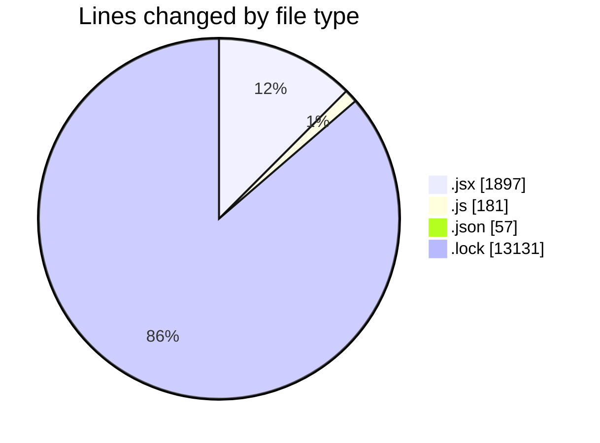
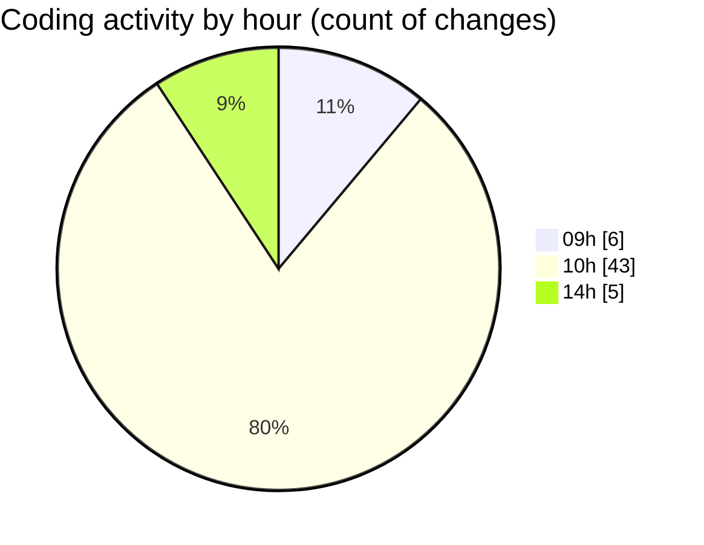

# cda - Activity Summary 

## Overall Statistics

| Stat                   | Value                                                             |
| ---------------------- | ----------------------------------------------------------------- |
| **Lines Added** (➕)   | 14597                                          |
| **Lines Removed** (➖) | 669                                        |
| **Net Change** (↕)    | 13928                |
| **Active Time** (⌚)   | 68 minutes |

## Modified Files
- **Agent.jsx** (+606, -27)
- **AISearchIcon.jsx** (+88, -51)
- **version.js** (+11, -0)
- **package.json** (+50, -7)
- **yarn.lock** (+12579, -552)
- **App.js** (+166, -4)
- **TransparencyChart.jsx** (+324, -4)
- **Explore.jsx** (+177, -5)
- **ExploreJob.jsx** (+303, -5)
- **ExploreJob.test.jsx** (+107, -4)
- **ExploreJobFamilies.jsx** (+91, -5)
- **Heading.jsx** (+20, -5)
- **Question.jsx** (+19, -0)
- **Answer.jsx** (+56, -0)

## Visualizations

### By File Type (Lines Changed)

### By Hour (Estimated Activity Count)

> **Last Updated:** 10/02/2026, 14:54:29