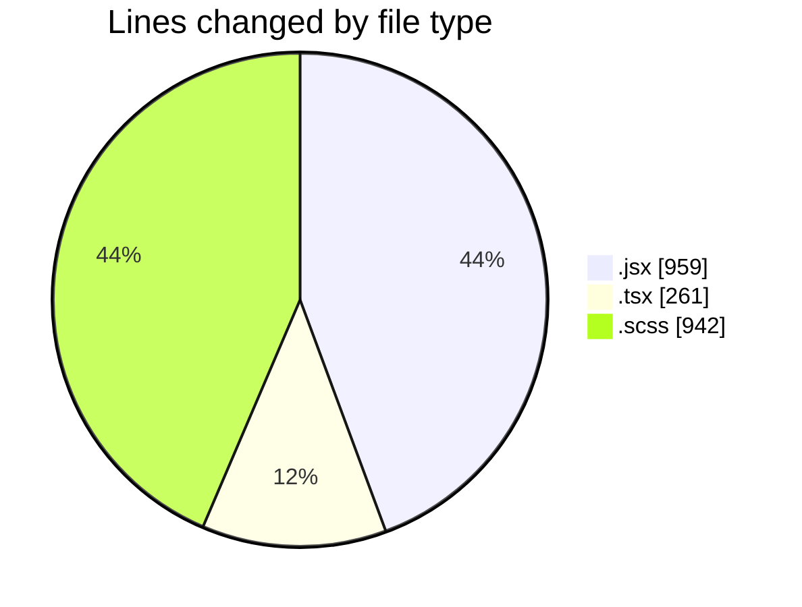
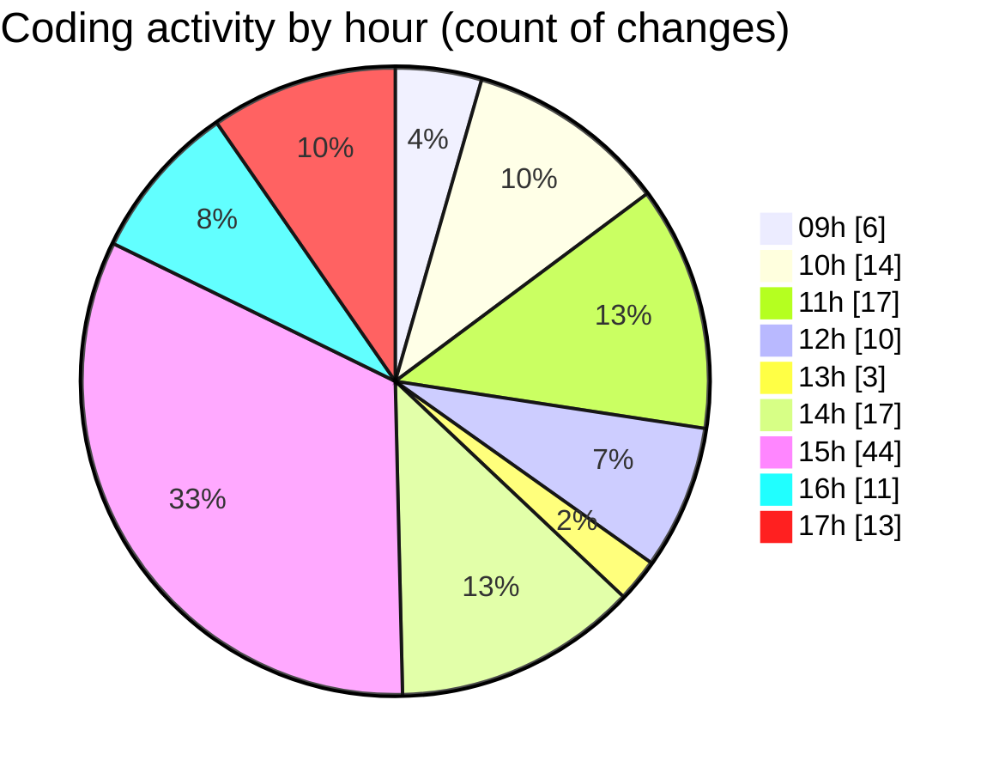

# cda - Activity Summary 

## Overall Statistics

| Stat                   | Value                                                             |
| ---------------------- | ----------------------------------------------------------------- |
| **Lines Added** (➕)   | 1635                                          |
| **Lines Removed** (➖) | 527                                        |
| **Net Change** (↕)    | 1108                |
| **Active Time** (⌚)   | 201 minutes |

## Modified Files
- **ChatInput.jsx** (+38, -47)
- **AddAttendeeModal.tsx** (+261, -0)
- **Question.jsx** (+62, -15)
- **Agent.jsx** (+554, -122)
- **Answer.jsx** (+112, -9)
- **App.scss** (+229, -149)
- **ScrollableDatepicker.scss** (+159, -0)
- **Agent.scss** (+220, -185)

## Visualizations

### By File Type (Lines Changed)

### By Hour (Estimated Activity Count)

> **Last Updated:** 11/02/2026, 17:12:15