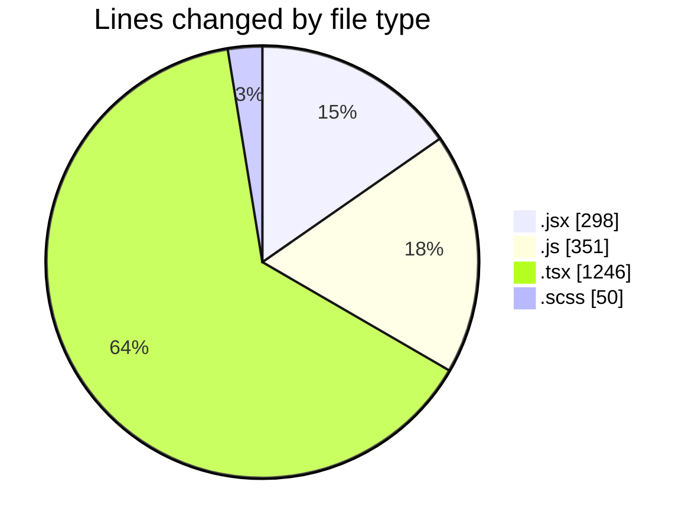
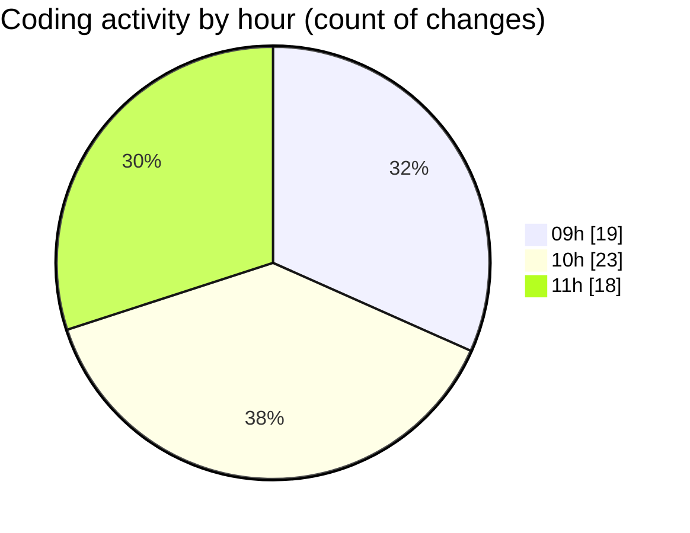

# cda - Activity Summary 

## Overall Statistics

| Stat                   | Value                                                             |
| ---------------------- | ----------------------------------------------------------------- |
| **Lines Added** (➕)   | 1703                                          |
| **Lines Removed** (➖) | 242                                        |
| **Net Change** (↕)    | 1461                |
| **Active Time** (⌚)   | 90 minutes |

## Modified Files
- **Agent.jsx** (+79, -64)
- **useDocumentTitle.jsx** (+37, -10)
- **useDocumentTitle.test.js** (+206, -145)
- **ChatInput.jsx** (+87, -21)
- **EventForm.tsx** (+1246, -0)
- **ChatInput.scss** (+48, -2)

## Visualizations

### By File Type (Lines Changed)

### By Hour (Estimated Activity Count)

> **Last Updated:** 12/02/2026, 11:22:17