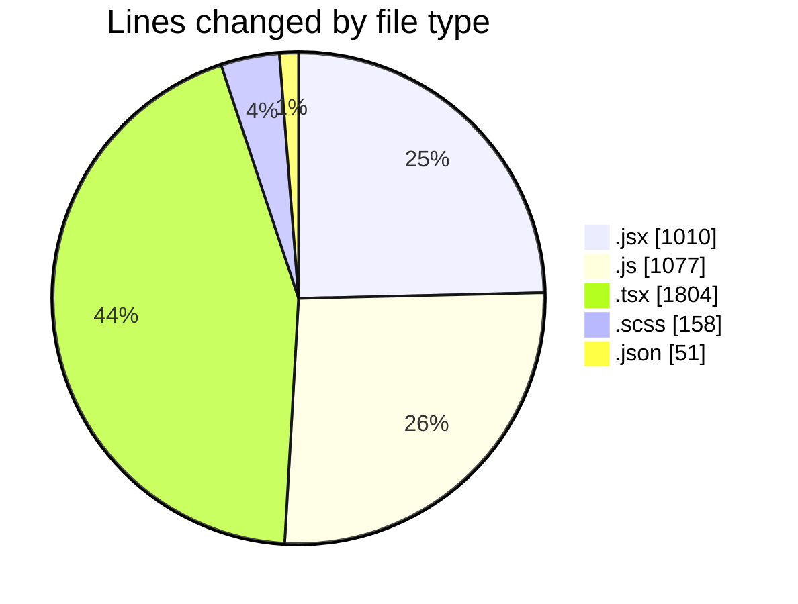
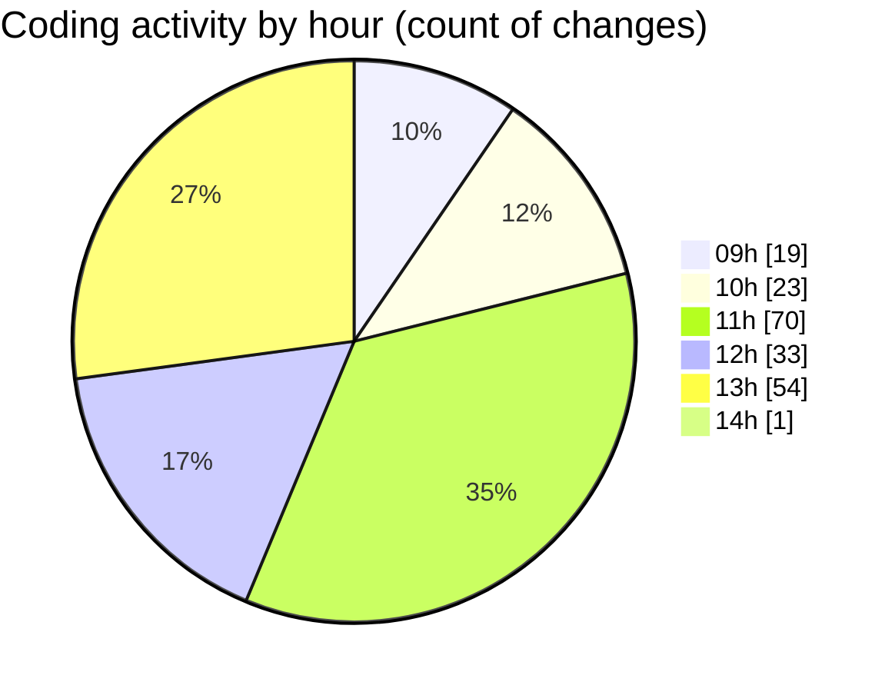

# cda - Activity Summary 

## Overall Statistics

| Stat                   | Value                                                             |
| ---------------------- | ----------------------------------------------------------------- |
| **Lines Added** (➕)   | 3508                                          |
| **Lines Removed** (➖) | 592                                        |
| **Net Change** (↕)    | 2916                |
| **Active Time** (⌚)   | 290 minutes |

## Modified Files
- **Agent.jsx** (+79, -64)
- **useDocumentTitle.jsx** (+37, -10)
- **useDocumentTitle.test.js** (+206, -145)
- **ChatInput.jsx** (+173, -104)
- **EventForm.tsx** (+1246, -0)
- **ChatInput.scss** (+55, -7)
- **ChatInput.test.js** (+285, -114)
- **AddAttendeeModal.test.tsx** (+558, -0)
- **Agent.test.js** (+211, -0)
- **AnswerReaction.jsx** (+108, -0)
- **SearchSuggestions.scss** (+22, -9)
- **agentsConfig.js** (+95, -1)
- **AnswerReactio.test.jsx** (+136, -96)
- **AnswerReaction.test.jsx** (+144, -28)
- **package.json** (+51, -0)
- **AssistantBadge.js** (+14, -6)
- **AssistantBadge.scss** (+36, -2)
- **Heading.jsx** (+25, -5)
- **Heading.scss** (+27, -0)
- **Answer.jsx** (+0, -1)

## Visualizations

### By File Type (Lines Changed)

### By Hour (Estimated Activity Count)

> **Last Updated:** 12/02/2026, 14:17:17