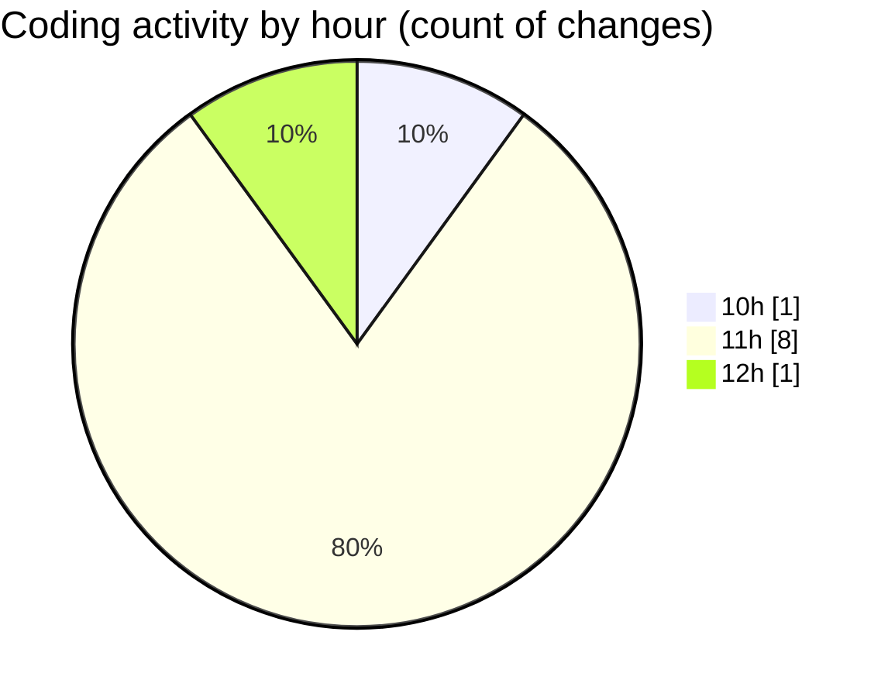

# cda - Activity Summary 

## Overall Statistics

| Stat                   | Value                                                             |
| ---------------------- | ----------------------------------------------------------------- |
| **Lines Added** (➕)   | 1293                                          |
| **Lines Removed** (➖) | 2                                        |
| **Net Change** (↕)    | 1291                |
| **Active Time** (⌚)   | 10 minutes |

## Modified Files
- **Agent.jsx** (+228, -0)
- **InclusionPassport.test.tsx** (+31, -0)
- **MyProfile.jsx** (+678, -0)
- **MyPreferences.tsx** (+206, -0)
- **PreferenceInclusionPassport.test.tsx** (+117, -0)
- **Question.jsx** (+33, -2)

## Visualizations

### By File Type (Lines Changed)

### By Hour (Estimated Activity Count)

> **Last Updated:** 16/02/2026, 12:01:25