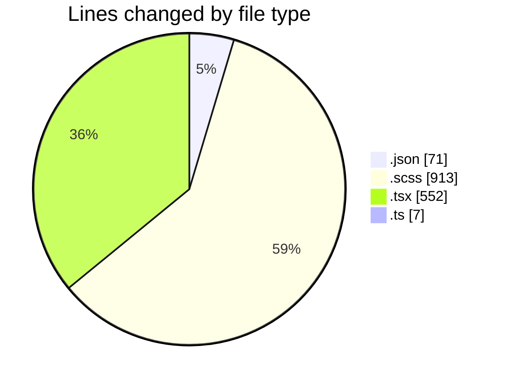
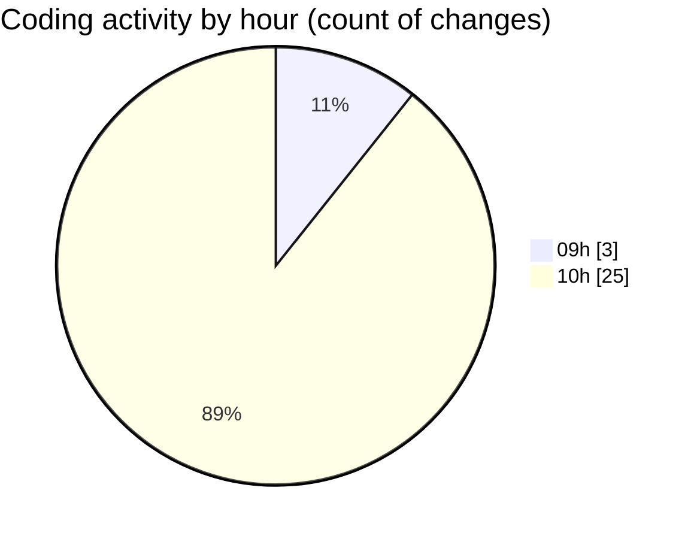

# cda - Activity Summary 

## Overall Statistics

| Stat                   | Value                                                             |
| ---------------------- | ----------------------------------------------------------------- |
| **Lines Added** (➕)   | 1512                                          |
| **Lines Removed** (➖) | 31                                        |
| **Net Change** (↕)    | 1481                |
| **Active Time** (⌚)   | 32 minutes |

## Modified Files
- **settings.json** (+71, -0)
- **EventForm.scss** (+167, -0)
- **EventPage.tsx** (+490, -1)
- **EventPage.scss** (+295, -13)
- **App.scss** (+65, -8)
- **App.tsx** (+61, -0)
- **global.d.ts** (+7, -0)
- **EventCard.scss** (+356, -9)

## Visualizations

### By File Type (Lines Changed)

### By Hour (Estimated Activity Count)

> **Last Updated:** 17/02/2026, 10:19:58