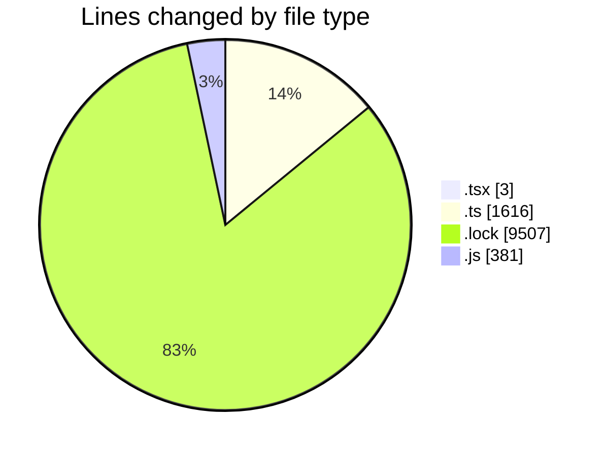
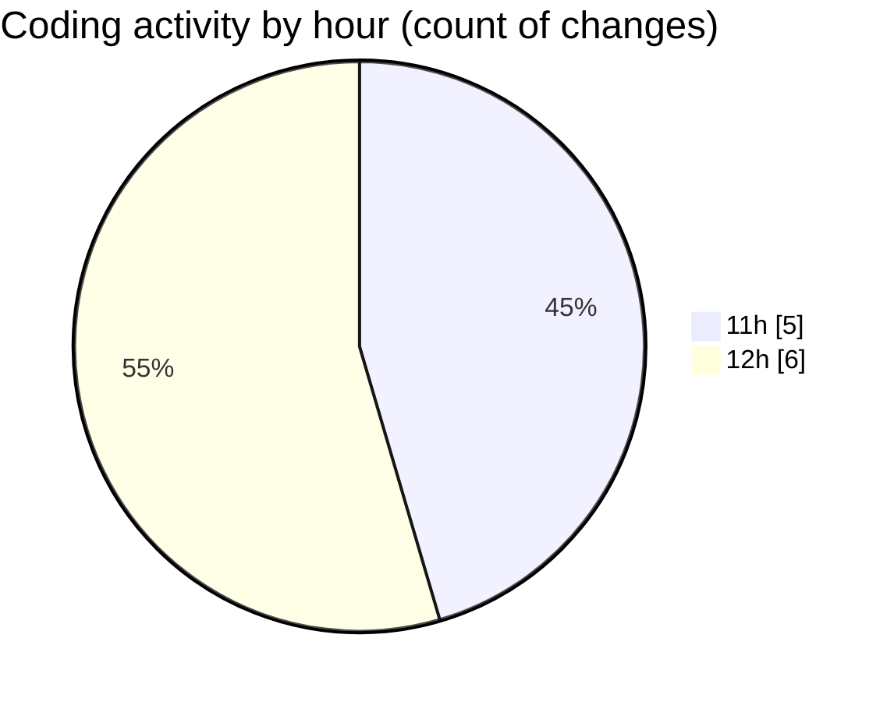

# cda - Activity Summary 

## Overall Statistics

| Stat                   | Value                                                             |
| ---------------------- | ----------------------------------------------------------------- |
| **Lines Added** (➕)   | 11500                                          |
| **Lines Removed** (➖) | 7                                        |
| **Net Change** (↕)    | 11493                |
| **Active Time** (⌚)   | 15 minutes |

## Modified Files
- **TruncatedJobTitle.tsx** (+1, -2)
- **it-kit.ts** (+162, -0)
- **yarn.lock** (+9372, -0)
- **yarn.lock** (+130, -5)
- **it-kit.js** (+381, -0)
- **sap_views.ts** (+1454, -0)

## Visualizations

### By File Type (Lines Changed)

### By Hour (Estimated Activity Count)

> **Last Updated:** 18/02/2026, 12:59:56