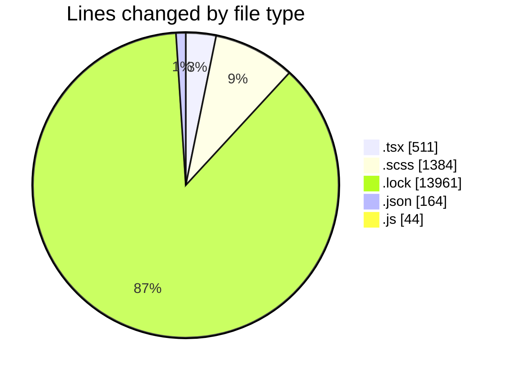
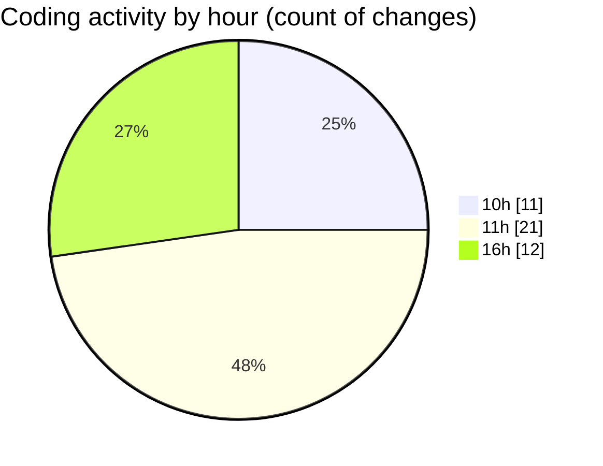

# cda - Activity Summary 

## Overall Statistics

| Stat                   | Value                                                             |
| ---------------------- | ----------------------------------------------------------------- |
| **Lines Added** (➕)   | 15664                                          |
| **Lines Removed** (➖) | 400                                        |
| **Net Change** (↕)    | 15264                |
| **Active Time** (⌚)   | 50 minutes |

## Modified Files
- **EventPage.tsx** (+498, -13)
- **EventCard.scss** (+709, -362)
- **EventPage.scss** (+292, -21)
- **yarn.lock** (+13961, -0)
- **package.json** (+85, -0)
- **settings.json** (+75, -4)
- **App.js** (+44, -0)

## Visualizations

### By File Type (Lines Changed)

### By Hour (Estimated Activity Count)

> **Last Updated:** 23/02/2026, 16:21:33