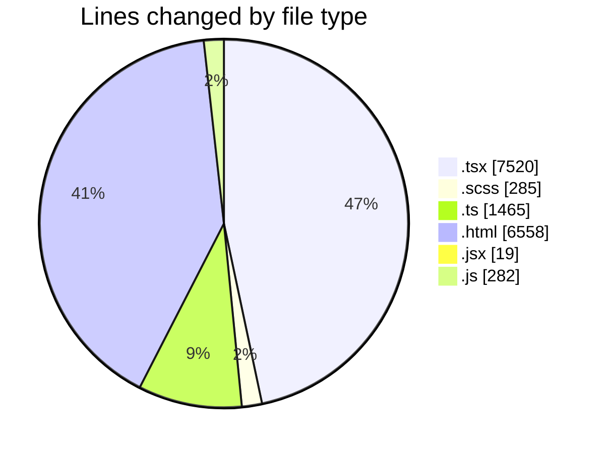
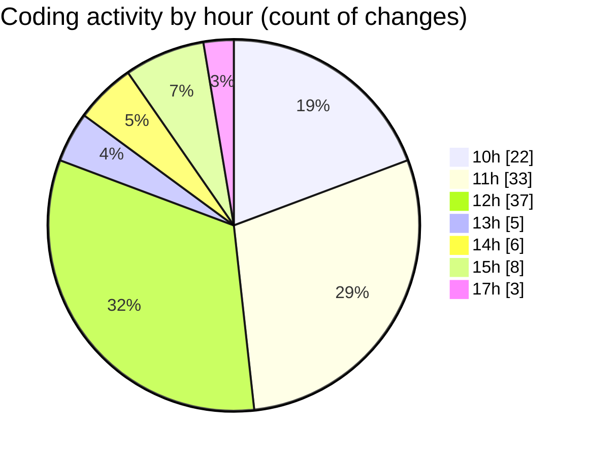

# cda - Activity Summary 

## Overall Statistics

| Stat                   | Value                                                             |
| ---------------------- | ----------------------------------------------------------------- |
| **Lines Added** (➕)   | 14005                                          |
| **Lines Removed** (➖) | 2124                                        |
| **Net Change** (↕)    | 11881                |
| **Active Time** (⌚)   | 190 minutes |

## Modified Files
- **EventPage.tsx** (+539, -52)
- **EventPage.scss** (+278, -7)
- **EventForm.tsx** (+1266, -20)
- **eventTypeFromFlags.ts** (+190, -95)
- **mapEventToForm.ts** (+68, -2)
- **calendar.ts** (+1110, -0)
- **EventPage.test.tsx** (+3705, -1938)
- **all_cars.html** (+6558, -0)
- **Question.jsx** (+19, -0)
- **agentsConfig.js** (+230, -10)
- **getDefaultSystemPrompt.js** (+42, -0)

## Visualizations

### By File Type (Lines Changed)

### By Hour (Estimated Activity Count)

> **Last Updated:** 25/02/2026, 17:51:55