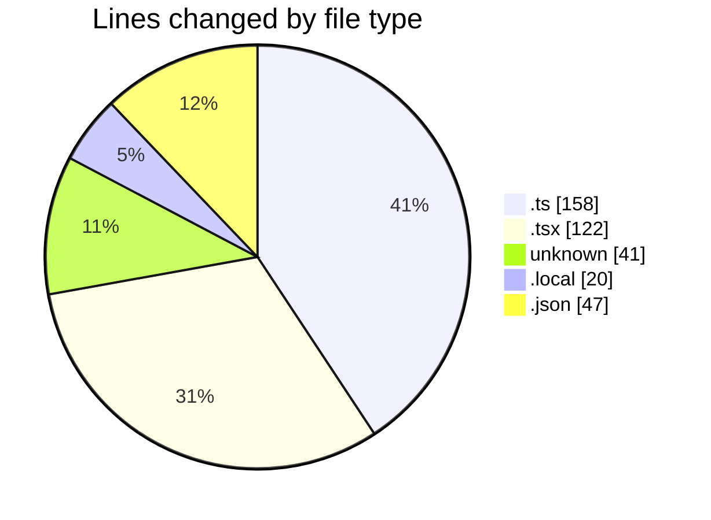
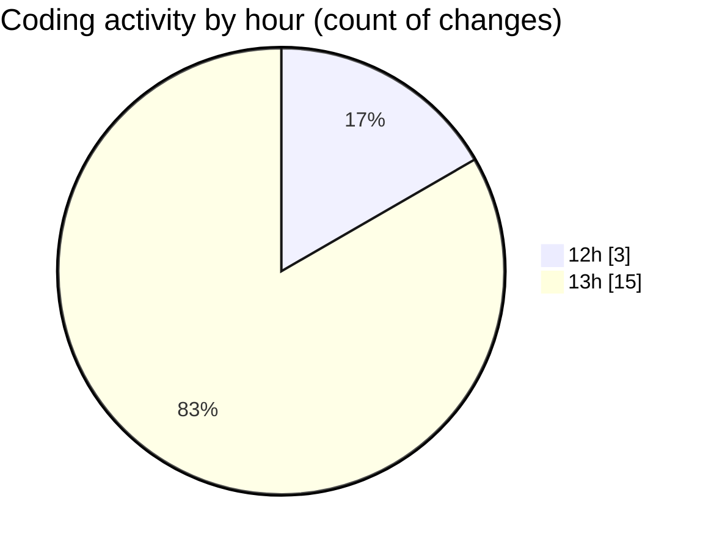

# car_database - Activity Summary 

## Overall Statistics

| Stat                   | Value                                                             |
| ---------------------- | ----------------------------------------------------------------- |
| **Lines Added** (➕)   | 387                                          |
| **Lines Removed** (➖) | 1                                        |
| **Net Change** (↕)    | 386                |
| **Active Time** (⌚)   | 20 minutes |

## Modified Files
- **cars.ts** (+66, -0)
- **page.tsx** (+122, -0)
- **.gitignore** (+41, -0)
- **.env.local** (+20, -0)
- **route.ts** (+82, -0)
- **index.ts** (+10, -0)
- **package.json** (+46, -1)

## Visualizations

### By File Type (Lines Changed)

### By Hour (Estimated Activity Count)

> **Last Updated:** 26/02/2026, 13:56:03