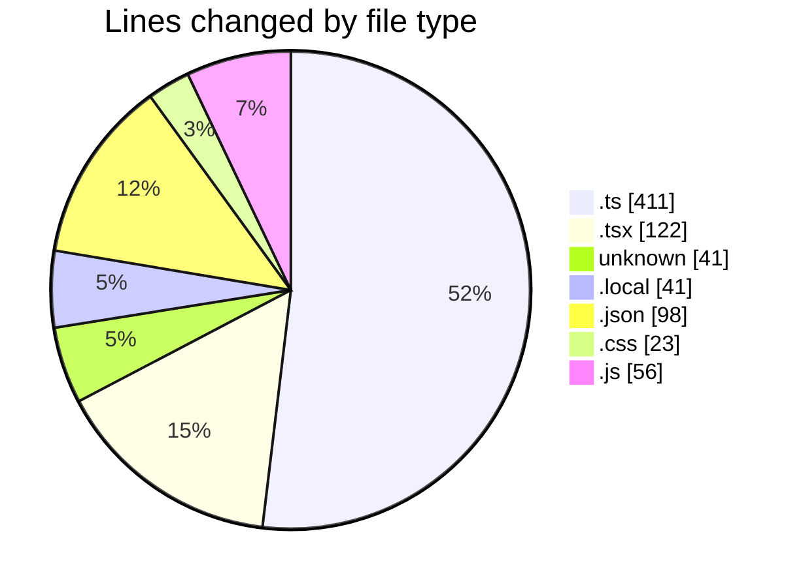
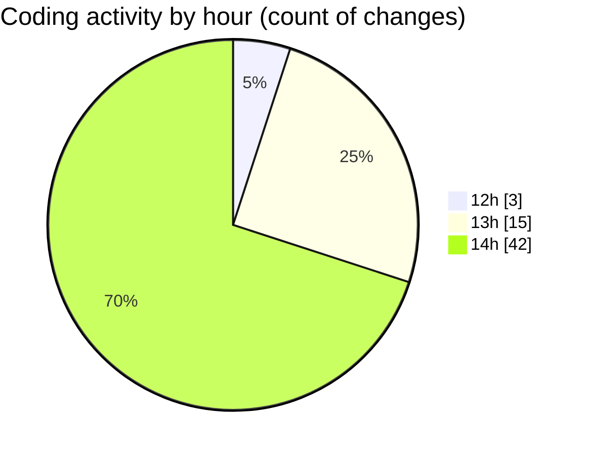

# car_database - Activity Summary 

## Overall Statistics

| Stat                   | Value                                                             |
| ---------------------- | ----------------------------------------------------------------- |
| **Lines Added** (➕)   | 760                                          |
| **Lines Removed** (➖) | 32                                        |
| **Net Change** (↕)    | 728                |
| **Active Time** (⌚)   | 79 minutes |

## Modified Files
- **cars.ts** (+66, -0)
- **page.tsx** (+122, -0)
- **.gitignore** (+41, -0)
- **.env.local** (+20, -0)
- **route.ts** (+95, -0)
- **index.ts** (+16, -1)
- **package.json** (+47, -2)
- **globals.css** (+18, -5)
- **tailwind.config.js** (+27, -9)
- **next.config.js** (+20, -0)
- **next.config.ts** (+20, -0)
- **setup.ts** (+66, -0)
- **route.ts** (+28, -0)
- **index.ts** (+5, -2)
- **cars.ts** (+17, -0)
- **.env.local** (+20, -1)
- **server.ts** (+40, -3)
- **car.ts** (+18, -0)
- **migrate.ts** (+14, -0)
- **tsconfig.json** (+42, -7)
- **tailwind.config.ts** (+18, -2)

## Visualizations

### By File Type (Lines Changed)

### By Hour (Estimated Activity Count)

> **Last Updated:** 26/02/2026, 14:46:04