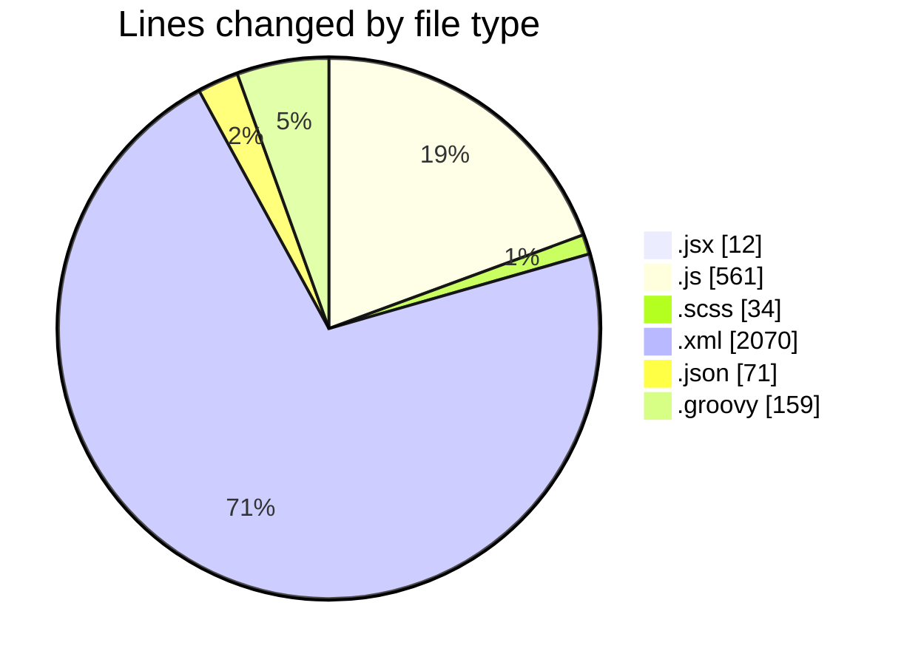
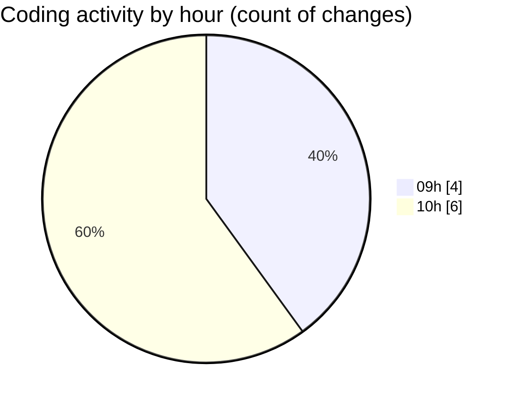

# cda - Activity Summary 

## Overall Statistics

| Stat                   | Value                                                             |
| ---------------------- | ----------------------------------------------------------------- |
| **Lines Added** (➕)   | 2864                                          |
| **Lines Removed** (➖) | 43                                        |
| **Net Change** (↕)    | 2821                |
| **Active Time** (⌚)   | 11 minutes |

## Modified Files
- **Question.jsx** (+12, -0)
- **Agent.test.js** (+211, -0)
- **AssistantBadge.scss** (+34, -0)
- **form.xml** (+2070, -0)
- **settings.json** (+71, -0)
- **agentsConfig.js** (+220, -0)
- **admin-gateway-assistant-data-sync.groovy** (+159, -0)
- **getDefaultSystemPrompt.js** (+87, -43)

## Visualizations

### By File Type (Lines Changed)

### By Hour (Estimated Activity Count)

> **Last Updated:** 26/02/2026, 10:39:39