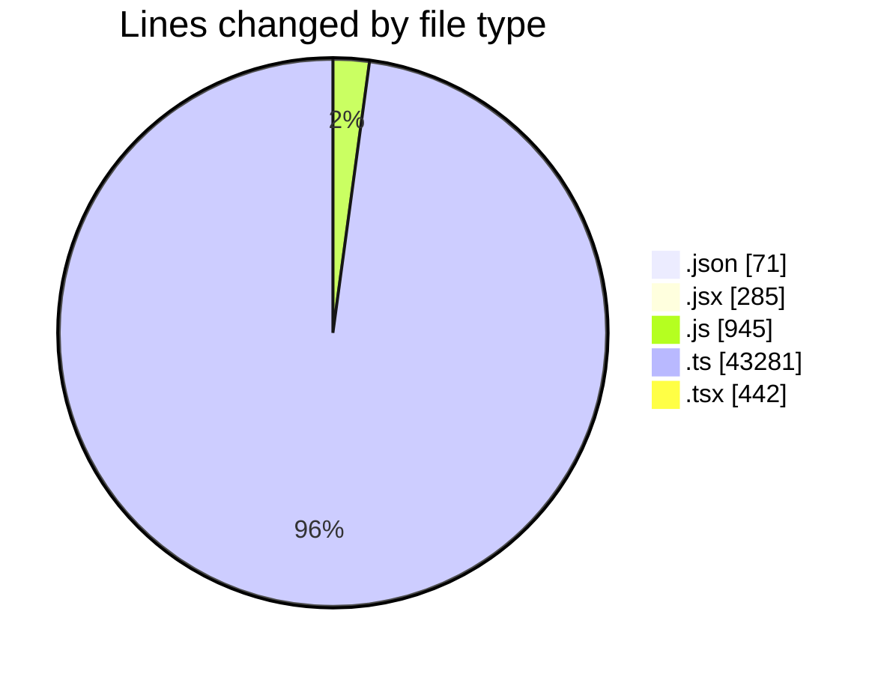
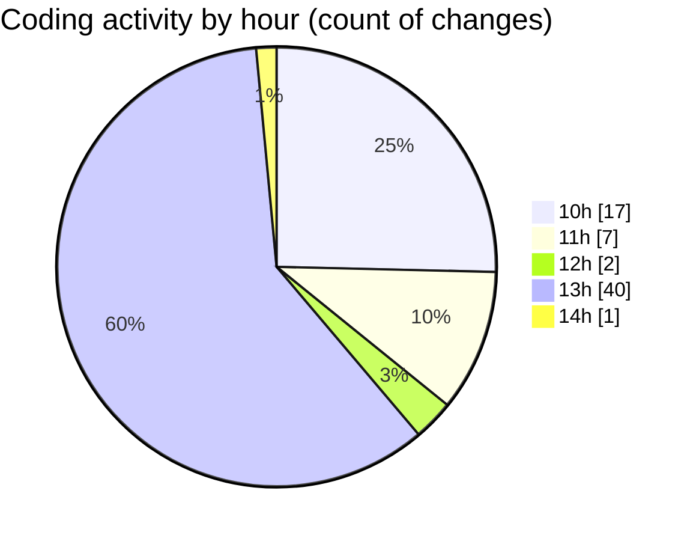

# cda - Activity Summary 

## Overall Statistics

| Stat                   | Value                                                             |
| ---------------------- | ----------------------------------------------------------------- |
| **Lines Added** (➕)   | 43873                                          |
| **Lines Removed** (➖) | 1151                                        |
| **Net Change** (↕)    | 42722                |
| **Active Time** (⌚)   | 86 minutes |

## Modified Files
- **settings.json** (+71, -0)
- **Agent.jsx** (+255, -30)
- **Agent.test.js** (+620, -129)
- **desks.js** (+157, -39)
- **desks.ts** (+842, -57)
- **resolvers-types.ts** (+14779, -134)
- **resolvers-types.ts** (+11135, -4)
- **index.ts** (+106, -0)
- **Book.tsx** (+430, -12)
- **gql.ts** (+100, -0)
- **graphql.ts** (+6353, -0)
- **graphql.ts** (+9025, -746)

## Visualizations

### By File Type (Lines Changed)

### By Hour (Estimated Activity Count)

> **Last Updated:** 02/03/2026, 14:05:46