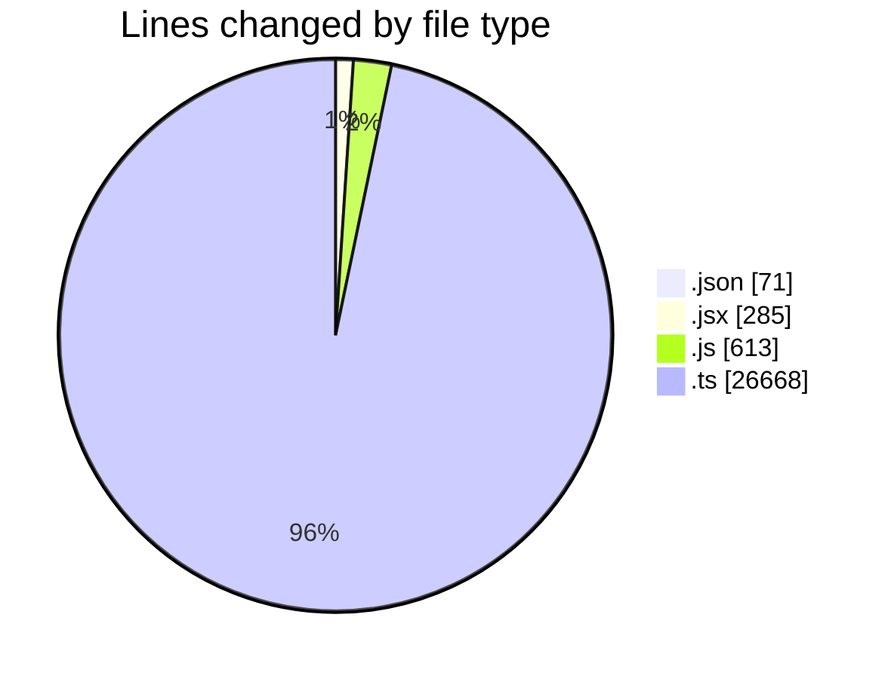
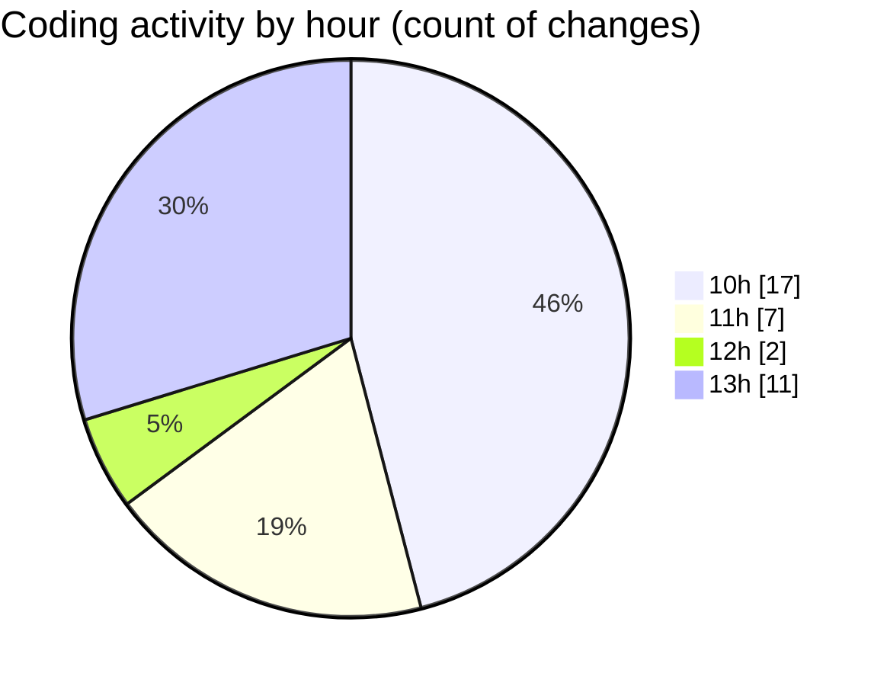

# cda - Activity Summary 

## Overall Statistics

| Stat                   | Value                                                             |
| ---------------------- | ----------------------------------------------------------------- |
| **Lines Added** (➕)   | 27465                                          |
| **Lines Removed** (➖) | 172                                        |
| **Net Change** (↕)    | 27293                |
| **Active Time** (⌚)   | 55 minutes |

## Modified Files
- **settings.json** (+71, -0)
- **Agent.jsx** (+255, -30)
- **Agent.test.js** (+340, -129)
- **desks.js** (+131, -13)
- **desks.ts** (+786, -0)
- **resolvers-types.ts** (+14645, -0)
- **resolvers-types.ts** (+11131, -0)
- **index.ts** (+106, -0)

## Visualizations

### By File Type (Lines Changed)

### By Hour (Estimated Activity Count)

> **Last Updated:** 02/03/2026, 13:15:31