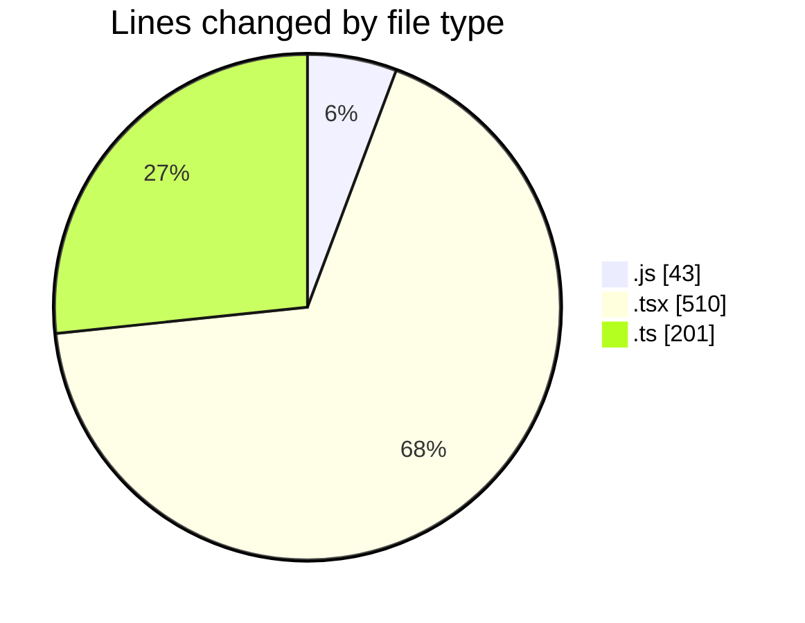
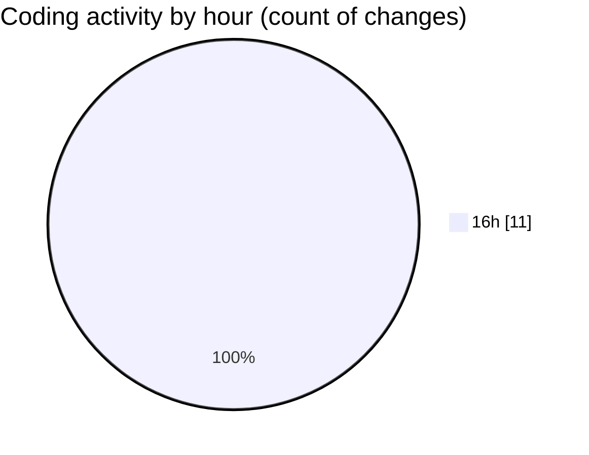

# cda - Activity Summary 

## Overall Statistics

| Stat                   | Value                                                             |
| ---------------------- | ----------------------------------------------------------------- |
| **Lines Added** (➕)   | 748                                          |
| **Lines Removed** (➖) | 6                                        |
| **Net Change** (↕)    | 742                |
| **Active Time** (⌚)   | 13 minutes |

## Modified Files
- **getDefaultSystemPrompt.js** (+43, -0)
- **ConstructDefinitionListItem.tsx** (+76, -0)
- **PublicDetailsPanel.tsx** (+183, -0)
- **ProfileFields.tsx** (+21, -0)
- **ConstructFieldRows.tsx** (+28, -5)
- **fieldUtils.ts** (+200, -1)
- **ProfilePublic.tsx** (+197, -0)

## Visualizations

### By File Type (Lines Changed)

### By Hour (Estimated Activity Count)

> **Last Updated:** 09/03/2026, 16:43:28