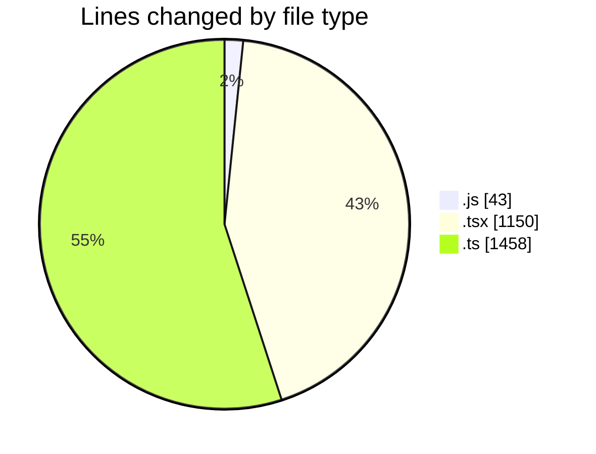
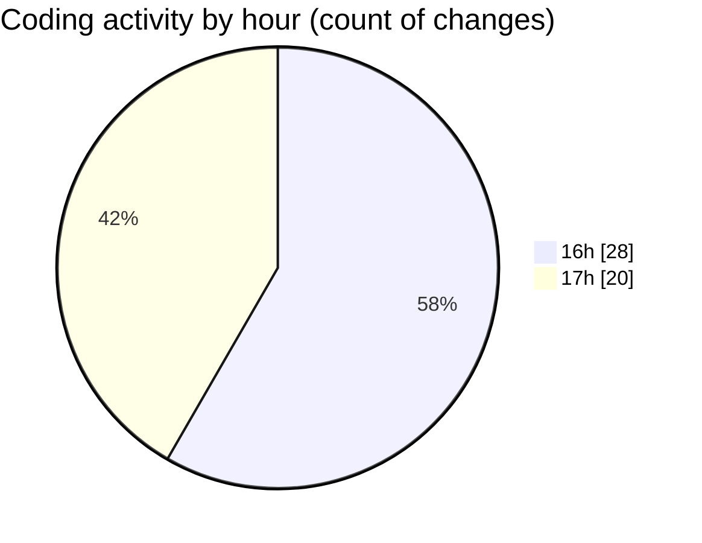

# cda - Activity Summary 

## Overall Statistics

| Stat                   | Value                                                             |
| ---------------------- | ----------------------------------------------------------------- |
| **Lines Added** (➕)   | 2524                                          |
| **Lines Removed** (➖) | 127                                        |
| **Net Change** (↕)    | 2397                |
| **Active Time** (⌚)   | 70 minutes |

## Modified Files
- **getDefaultSystemPrompt.js** (+43, -0)
- **ConstructDefinitionListItem.tsx** (+76, -0)
- **PublicDetailsPanel.tsx** (+184, -0)
- **ProfileFields.tsx** (+21, -0)
- **ConstructFieldRows.tsx** (+42, -19)
- **fieldUtils.ts** (+206, -8)
- **ProfilePublic.tsx** (+197, -0)
- **PersonalDetailsPanel.tsx** (+185, -4)
- **ProfileContainer.tsx** (+174, -93)
- **ConstructFieldContent.tsx** (+49, -1)
- **App.tsx** (+105, -0)
- **profileFieldsConfig.ts** (+473, -2)
- **queries.ts** (+769, -0)

## Visualizations

### By File Type (Lines Changed)

### By Hour (Estimated Activity Count)

> **Last Updated:** 09/03/2026, 17:48:28