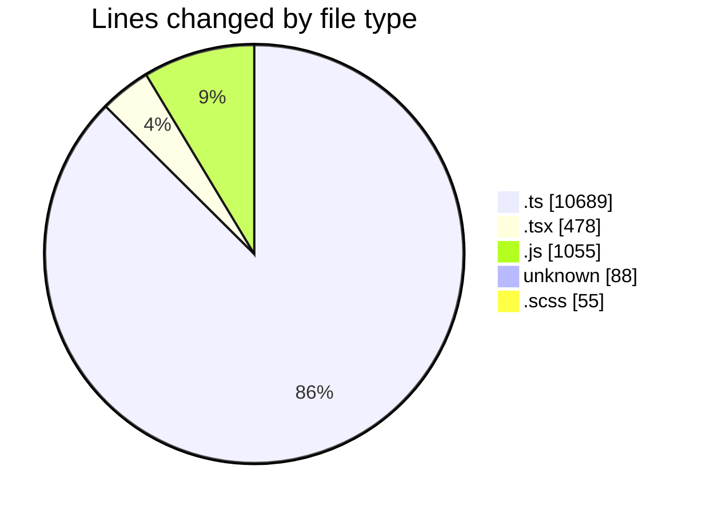
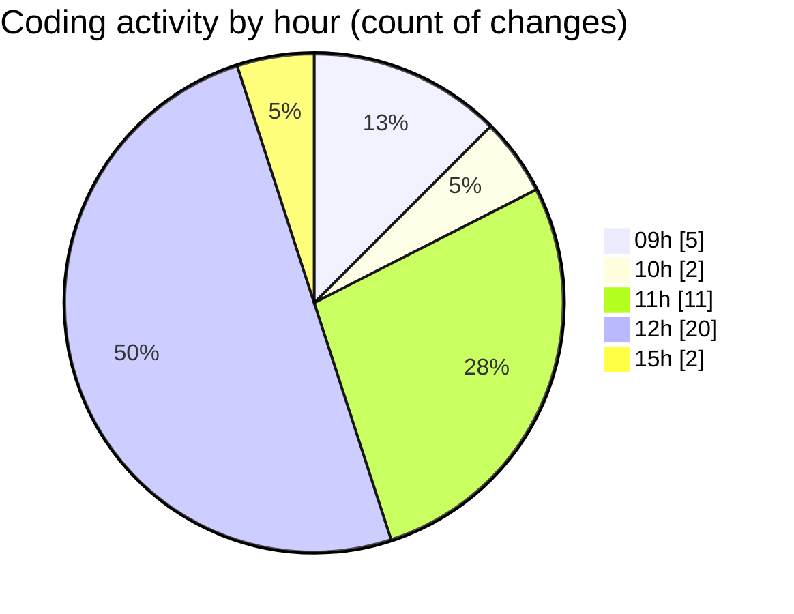

# cda - Activity Summary 

## Overall Statistics

| Stat                   | Value                                                             |
| ---------------------- | ----------------------------------------------------------------- |
| **Lines Added** (➕)   | 12353                                          |
| **Lines Removed** (➖) | 12                                        |
| **Net Change** (↕)    | 12341                |
| **Active Time** (⌚)   | 52 minutes |

## Modified Files
- **queries.ts** (+771, -1)
- **MyTeam.tsx** (+211, -1)
- **team.js** (+141, -2)
- **20260311111518-replace-peopleview-teams-view.js** (+59, -0)
- **20260202163922-replace-peopleview-profiles-view.js** (+127, -0)
- **.env** (+88, -0)
- **peopleview-views.js** (+166, -0)
- **PeopleViewRepository.js** (+130, -0)
- **peopleview.js** (+426, -4)
- **sap_views.ts** (+1468, -0)
- **gql.ts** (+112, -0)
- **graphql.ts** (+8289, -0)
- **PeopleList.tsx** (+152, -3)
- **MyTeam.types.ts** (+47, -1)
- **PersonRow.tsx** (+111, -0)
- **PersonRow.scss** (+55, -0)

## Visualizations

### By File Type (Lines Changed)

### By Hour (Estimated Activity Count)

> **Last Updated:** 11/03/2026, 15:38:59