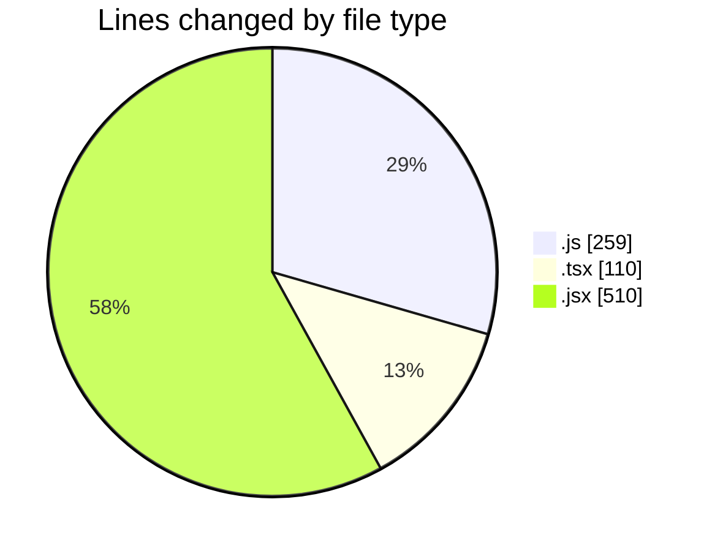
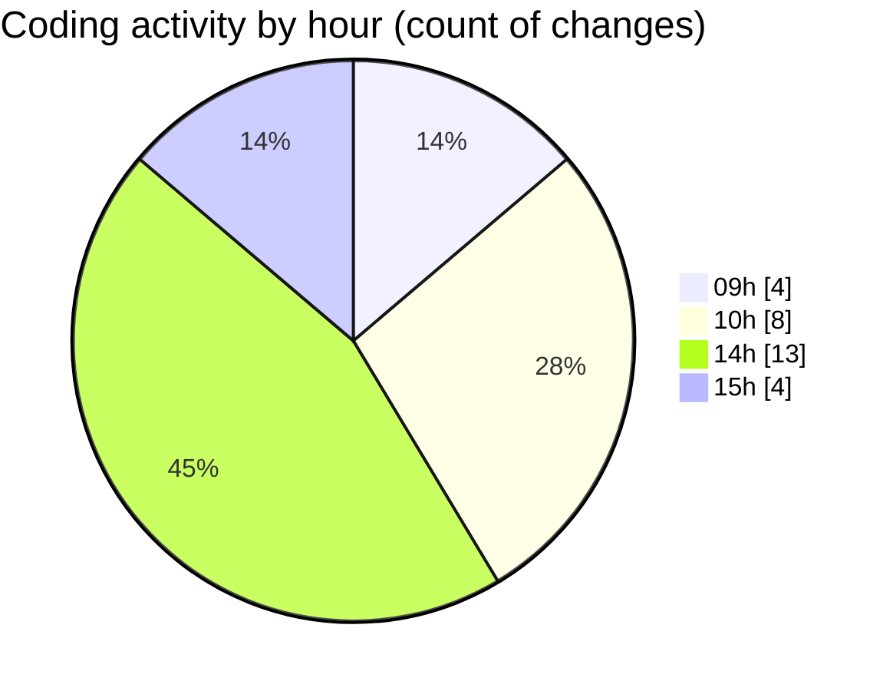

# cda - Activity Summary 

## Overall Statistics

| Stat                   | Value                                                             |
| ---------------------- | ----------------------------------------------------------------- |
| **Lines Added** (➕)   | 749                                          |
| **Lines Removed** (➖) | 130                                        |
| **Net Change** (↕)    | 619                |
| **Active Time** (⌚)   | 26 minutes |

## Modified Files
- **PeopleViewRepository.js** (+0, -12)
- **team.test.js** (+29, -19)
- **peopleview-queries.js** (+0, -60)
- **PersonRow.tsx** (+110, -0)
- **team.js** (+139, -0)
- **Agent.jsx** (+231, -6)
- **AnswerReaction.jsx** (+130, -4)
- **Answer.jsx** (+54, -6)
- **Question.jsx** (+56, -23)

## Visualizations

### By File Type (Lines Changed)

### By Hour (Estimated Activity Count)

> **Last Updated:** 12/03/2026, 15:06:01