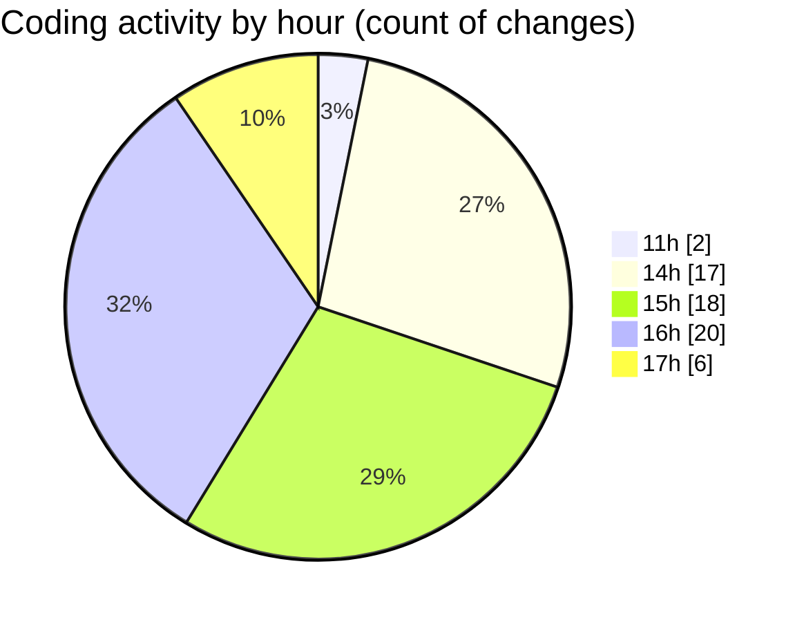

# cda - Activity Summary 

## Overall Statistics

| Stat                   | Value                                                             |
| ---------------------- | ----------------------------------------------------------------- |
| **Lines Added** (➕)   | 1959                                          |
| **Lines Removed** (➖) | 52                                        |
| **Net Change** (↕)    | 1907                |
| **Active Time** (⌚)   | 95 minutes |

## Modified Files
- **Promo.jsx** (+27, -0)
- **Promo.scss** (+125, -6)
- **PersonRow.tsx** (+110, -0)
- **ProfilePublic.tsx** (+199, -0)
- **AttachmentDetailsPanel.test.tsx** (+145, -0)
- **EmploymentDetailsPanel.tsx** (+41, -1)
- **AttachmentDetailsPanel.tsx** (+55, -28)
- **profileFieldsConfig.ts** (+502, -9)
- **ProfileFields.types.ts** (+118, -2)
- **.env** (+91, -0)
- **ConstructDefinitionListItem.tsx** (+76, -0)
- **PeopleList.tsx** (+149, -0)
- **Profile.types.ts** (+321, -6)

## Visualizations

### By File Type (Lines Changed)

### By Hour (Estimated Activity Count)

> **Last Updated:** 16/03/2026, 17:16:00