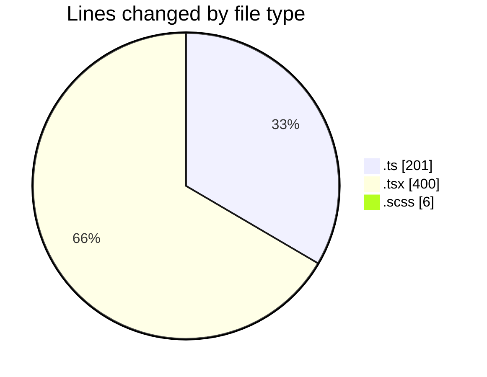
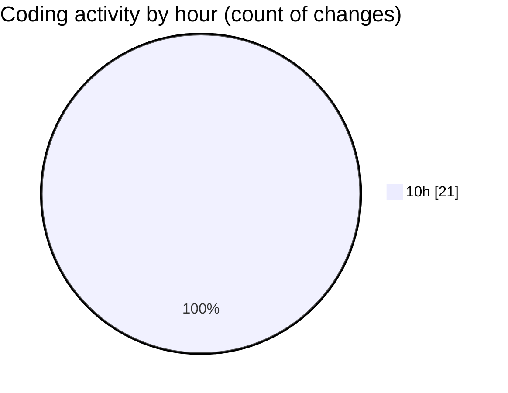

# cda - Activity Summary 

## Overall Statistics

| Stat                   | Value                                                             |
| ---------------------- | ----------------------------------------------------------------- |
| **Lines Added** (➕)   | 466                                          |
| **Lines Removed** (➖) | 141                                        |
| **Net Change** (↕)    | 325                |
| **Active Time** (⌚)   | 30 minutes |

## Modified Files
- **fieldUtils.ts** (+201, -0)
- **AttachmentDetailsPanel.test.tsx** (+232, -141)
- **AttachmentDetailsPanel.tsx** (+27, -0)
- **Panel.scss** (+6, -0)

## Visualizations

### By File Type (Lines Changed)

### By Hour (Estimated Activity Count)

> **Last Updated:** 17/03/2026, 10:43:46