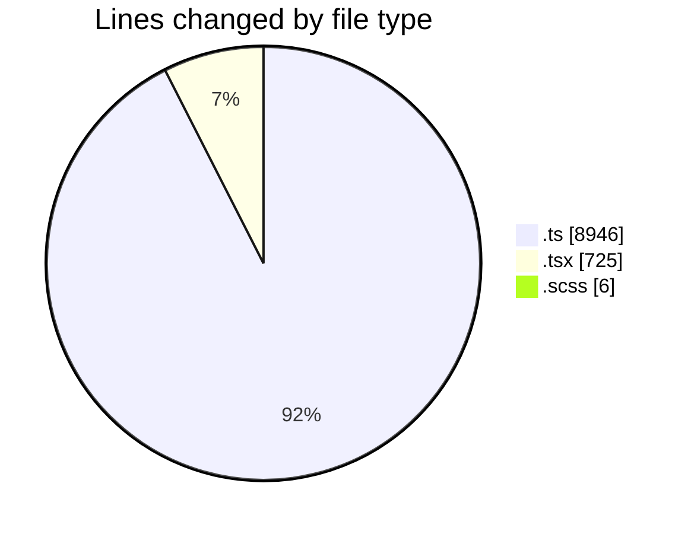
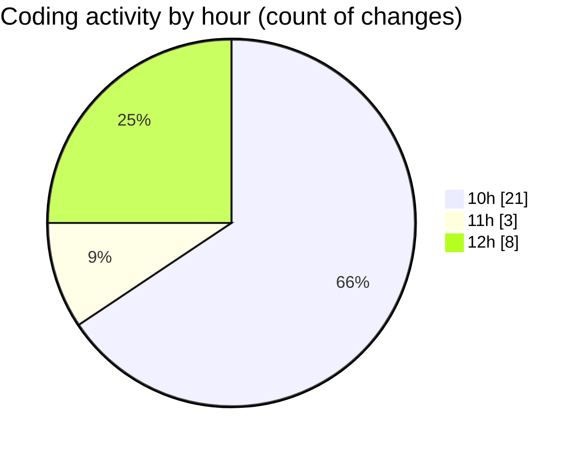

# cda - Activity Summary 

## Overall Statistics

| Stat                   | Value                                                             |
| ---------------------- | ----------------------------------------------------------------- |
| **Lines Added** (➕)   | 9401                                          |
| **Lines Removed** (➖) | 276                                        |
| **Net Change** (↕)    | 9125                |
| **Active Time** (⌚)   | 44 minutes |

## Modified Files
- **fieldUtils.ts** (+201, -0)
- **AttachmentDetailsPanel.test.tsx** (+323, -141)
- **AttachmentDetailsPanel.tsx** (+55, -0)
- **Panel.scss** (+6, -0)
- **ProfilePublic.tsx** (+203, -3)
- **Profile.types.ts** (+324, -9)
- **graphql.ts** (+8289, -123)

## Visualizations

### By File Type (Lines Changed)

### By Hour (Estimated Activity Count)

> **Last Updated:** 17/03/2026, 12:08:01