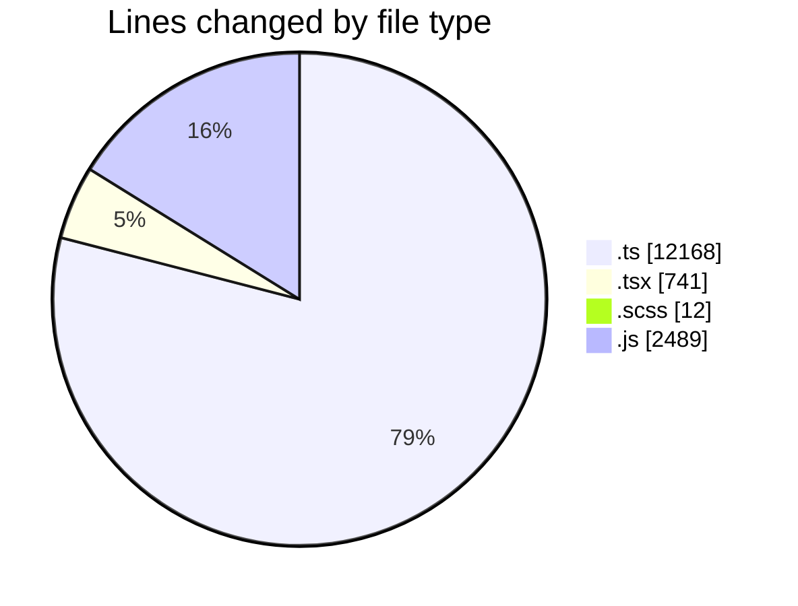
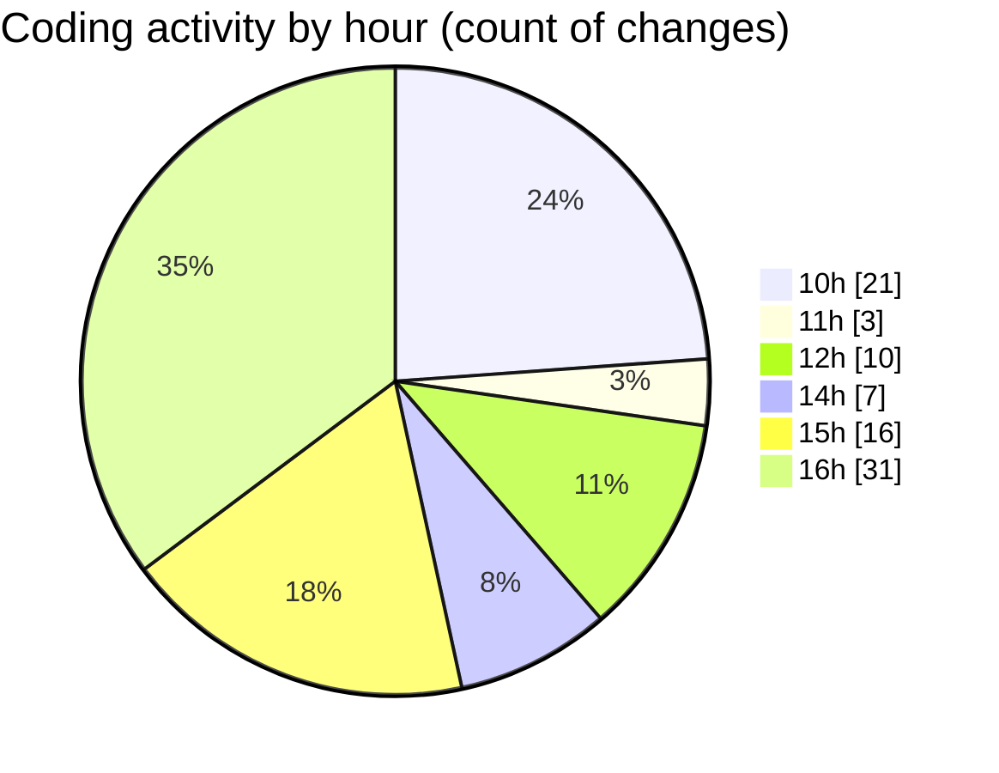

# cda - Activity Summary 

## Overall Statistics

| Stat                   | Value                                                             |
| ---------------------- | ----------------------------------------------------------------- |
| **Lines Added** (➕)   | 15082                                          |
| **Lines Removed** (➖) | 328                                        |
| **Net Change** (↕)    | 14754                |
| **Active Time** (⌚)   | 124 minutes |

## Modified Files
- **fieldUtils.ts** (+407, -6)
- **AttachmentDetailsPanel.test.tsx** (+323, -141)
- **AttachmentDetailsPanel.tsx** (+58, -1)
- **Panel.scss** (+12, -0)
- **ProfilePublic.tsx** (+209, -9)
- **Profile.types.ts** (+343, -27)
- **graphql.ts** (+8289, -123)
- **20260317142951-replace-peopleview-teams-view.js** (+60, -0)
- **profile.js** (+241, -4)
- **team.js** (+141, -2)
- **team.test.js** (+493, -10)
- **20260202163922-replace-peopleview-profiles-view.js** (+128, -0)
- **20260317154110-dsf.js** (+128, -0)
- **sap_views.ts** (+1470, -0)
- **profile.test.js** (+853, -4)
- **peopleview.js** (+424, -1)
- **profileFieldsConfig.ts** (+493, -0)
- **ProfileFields.types.ts** (+116, -0)
- **queries.ts** (+782, -0)
- **gql.ts** (+112, -0)

## Visualizations

### By File Type (Lines Changed)

### By Hour (Estimated Activity Count)

> **Last Updated:** 17/03/2026, 16:58:01