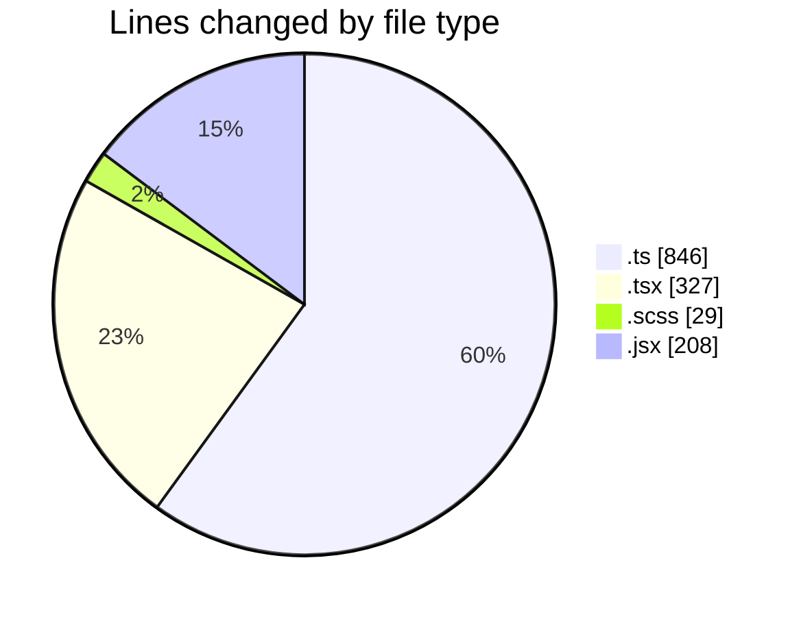
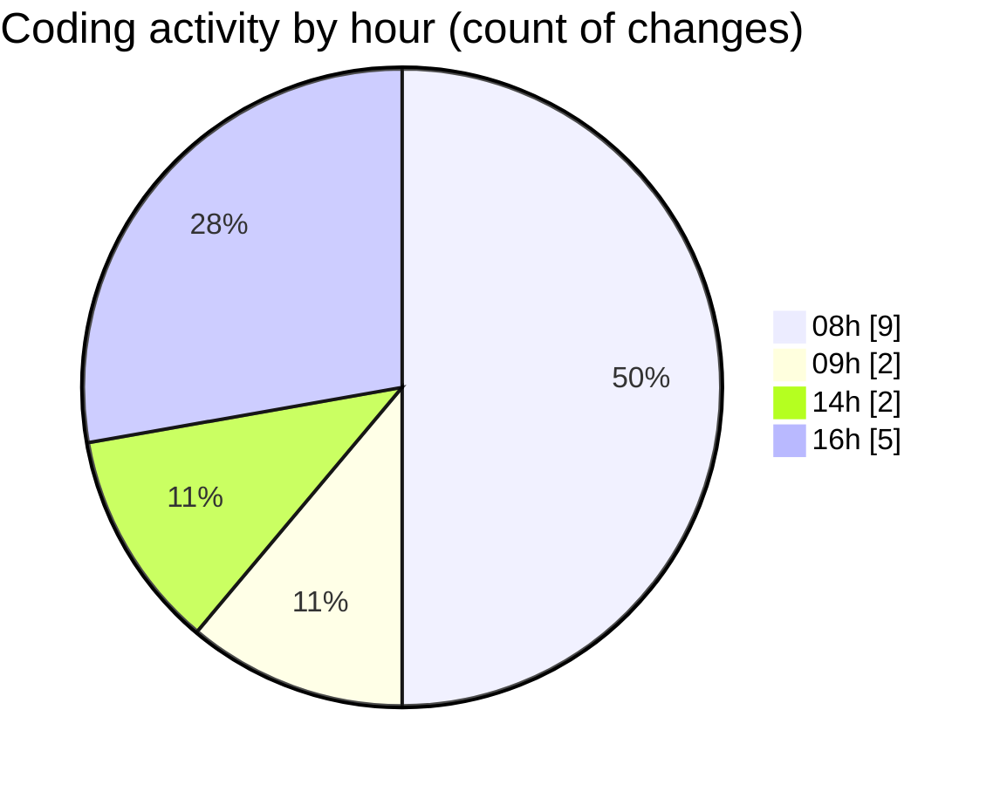

# cda - Activity Summary 

## Overall Statistics

| Stat                   | Value                                                             |
| ---------------------- | ----------------------------------------------------------------- |
| **Lines Added** (➕)   | 1386                                          |
| **Lines Removed** (➖) | 24                                        |
| **Net Change** (↕)    | 1362                |
| **Active Time** (⌚)   | 13 minutes |

## Modified Files
- **ProfileFields.types.ts** (+133, -16)
- **AttachmentDetailsPanel.tsx** (+32, -0)
- **ProfilePublic.tsx** (+197, -0)
- **Question.scss** (+23, -6)
- **fieldUtils.ts** (+202, -2)
- **AssetEntry.jsx** (+208, -0)
- **profileFieldsConfig.ts** (+493, -0)
- **AttachmentDetailsPanel.test.tsx** (+98, -0)

## Visualizations

### By File Type (Lines Changed)

### By Hour (Estimated Activity Count)

> **Last Updated:** 18/03/2026, 16:24:26