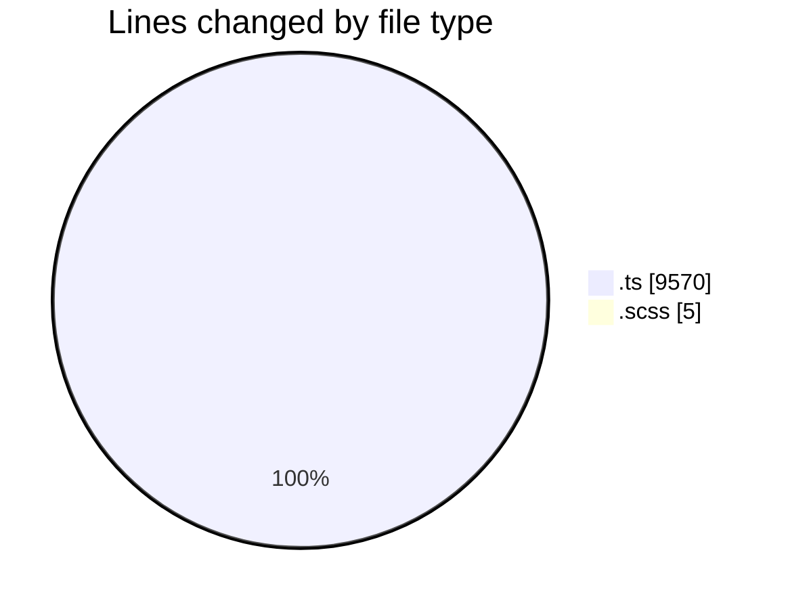
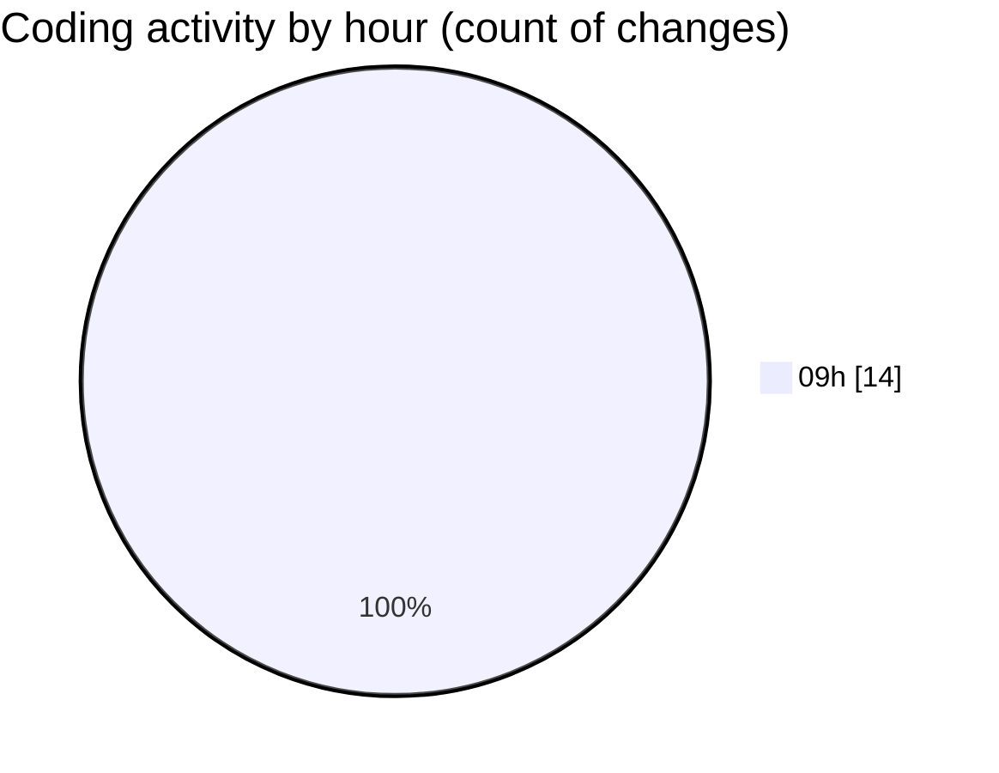

# cda - Activity Summary 

## Overall Statistics

| Stat                   | Value                                                             |
| ---------------------- | ----------------------------------------------------------------- |
| **Lines Added** (➕)   | 9513                                          |
| **Lines Removed** (➖) | 62                                        |
| **Net Change** (↕)    | 9451                |
| **Active Time** (⌚)   | 11 minutes |

## Modified Files
- **fieldUtils.ts** (+2, -4)
- **ProfileFields.types.ts** (+8, -16)
- **profileFieldsConfig.ts** (+21, -42)
- **queries.ts** (+770, -0)
- **gql.ts** (+112, -0)
- **Profile.types.ts** (+306, -0)
- **graphql.ts** (+8289, -0)
- **Panel.scss** (+5, -0)

## Visualizations

### By File Type (Lines Changed)

### By Hour (Estimated Activity Count)

> **Last Updated:** 19/03/2026, 09:00:19