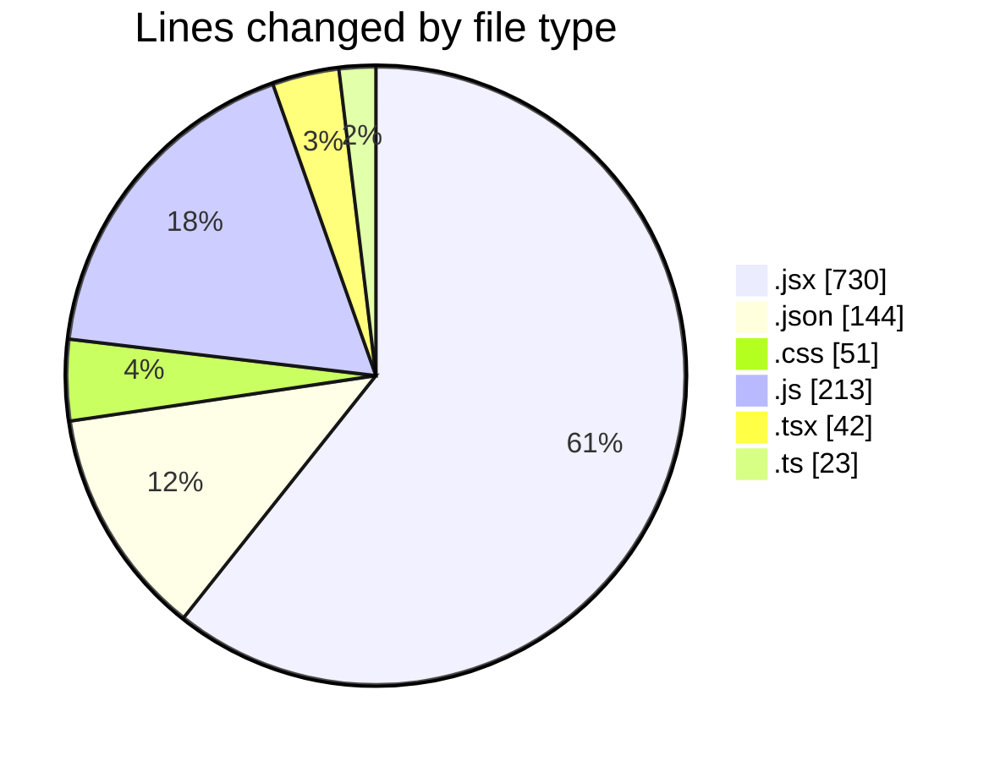
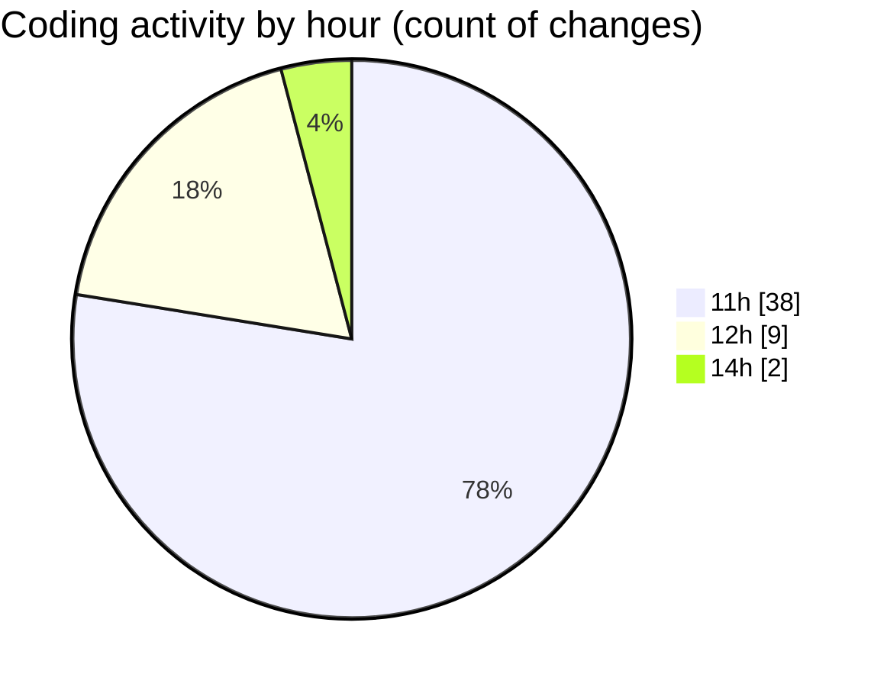

# commonwealth-front-end-task - Activity Summary 

## Overall Statistics

| Stat                   | Value                                                             |
| ---------------------- | ----------------------------------------------------------------- |
| **Lines Added** (➕)   | 1027                                          |
| **Lines Removed** (➖) | 176                                        |
| **Net Change** (↕)    | 851                |
| **Active Time** (⌚)   | 55 minutes |

## Modified Files
- **MedalsTable.jsx** (+144, -48)
- **settings.json** (+144, -0)
- **MedalsTable.jsx** (+64, -0)
- **Home.jsx** (+346, -128)
- **MedalsTable.css** (+51, -0)
- **MedalsTable.test.js** (+167, -0)
- **App.js** (+23, -0)
- **Home.tsx** (+42, -0)
- **App.ts** (+23, -0)
- **App.js** (+23, -0)

## Visualizations

### By File Type (Lines Changed)

### By Hour (Estimated Activity Count)

> **Last Updated:** 19/03/2026, 14:06:52