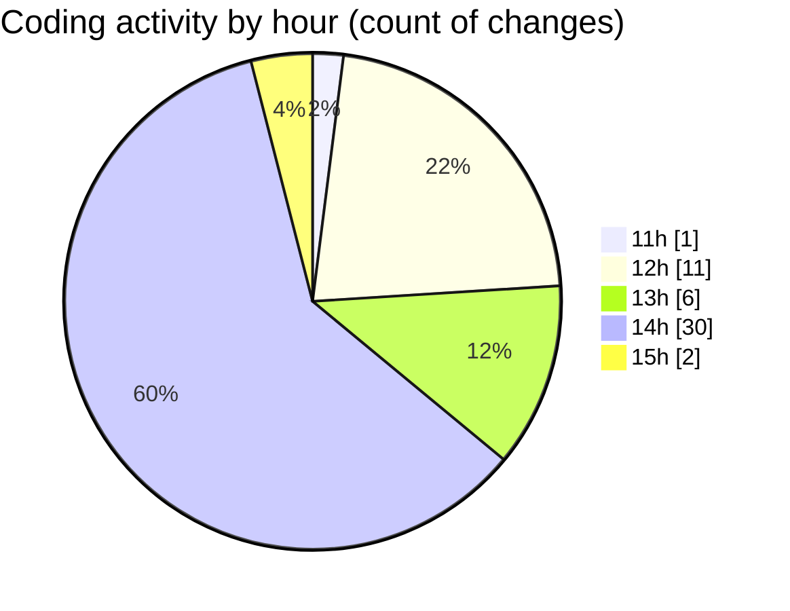

# cda - Activity Summary 

## Overall Statistics

| Stat                   | Value                                                             |
| ---------------------- | ----------------------------------------------------------------- |
| **Lines Added** (➕)   | 4811                                          |
| **Lines Removed** (➖) | 89                                        |
| **Net Change** (↕)    | 4722                |
| **Active Time** (⌚)   | 94 minutes |

## Modified Files
- **package.json** (+66, -1)
- **Tooltip.tsx** (+135, -22)
- **Tooltip.test.tsx** (+108, -5)
- **package.json** (+188, -3)
- **FeedbackModal.tsx** (+314, -0)
- **debug-storybook.log** (+72, -46)
- **main.js** (+102, -12)
- **sb.log** (+3826, -0)

## Visualizations

### By File Type (Lines Changed)

### By Hour (Estimated Activity Count)

> **Last Updated:** 24/03/2026, 15:04:53