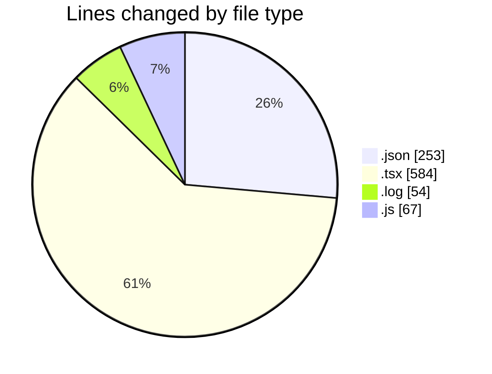
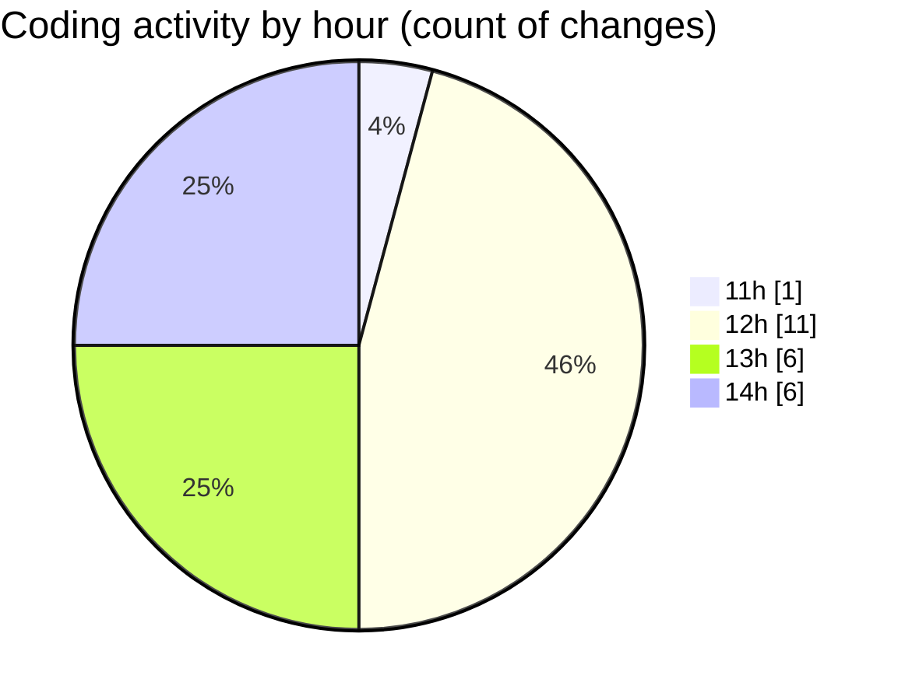

# cda - Activity Summary 

## Overall Statistics

| Stat                   | Value                                                             |
| ---------------------- | ----------------------------------------------------------------- |
| **Lines Added** (➕)   | 930                                          |
| **Lines Removed** (➖) | 28                                        |
| **Net Change** (↕)    | 902                |
| **Active Time** (⌚)   | 46 minutes |

## Modified Files
- **package.json** (+66, -1)
- **Tooltip.tsx** (+135, -22)
- **Tooltip.test.tsx** (+108, -5)
- **package.json** (+186, -0)
- **FeedbackModal.tsx** (+314, -0)
- **debug-storybook.log** (+54, -0)
- **main.js** (+67, -0)

## Visualizations

### By File Type (Lines Changed)

### By Hour (Estimated Activity Count)

> **Last Updated:** 24/03/2026, 14:24:53