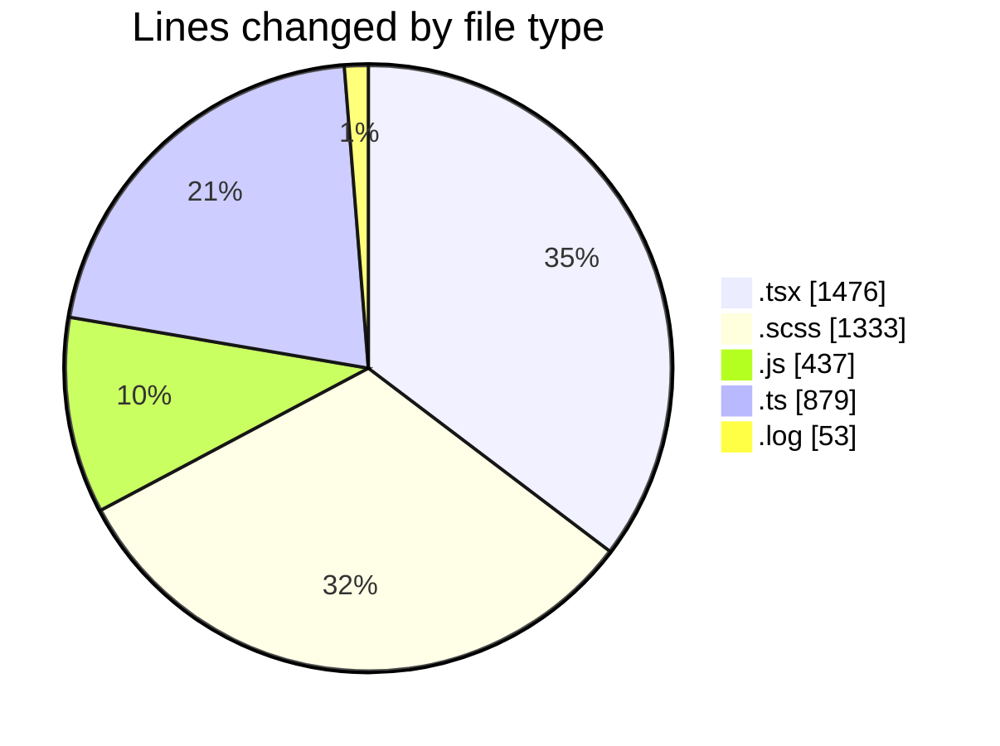
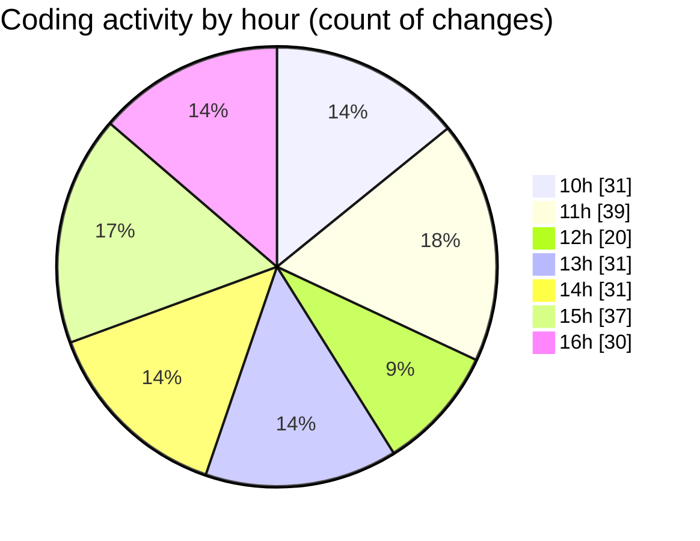

# cda - Activity Summary 

## Overall Statistics

| Stat                   | Value                                                             |
| ---------------------- | ----------------------------------------------------------------- |
| **Lines Added** (➕)   | 2788                                          |
| **Lines Removed** (➖) | 1390                                        |
| **Net Change** (↕)    | 1398                |
| **Active Time** (⌚)   | 270 minutes |

## Modified Files
- **Tooltip.tsx** (+762, -616)
- **tooltip.scss** (+741, -592)
- **Tooltip.stories.js** (+140, -3)
- **tooltipPositioning.ts** (+225, -145)
- **profileFieldsConfig.ts** (+501, -8)
- **debug-storybook.log** (+27, -26)
- **AttachmentDetailsPanel.test.tsx** (+98, -0)
- **peopleview.js** (+294, -0)

## Visualizations

### By File Type (Lines Changed)

### By Hour (Estimated Activity Count)

> **Last Updated:** 25/03/2026, 16:57:35