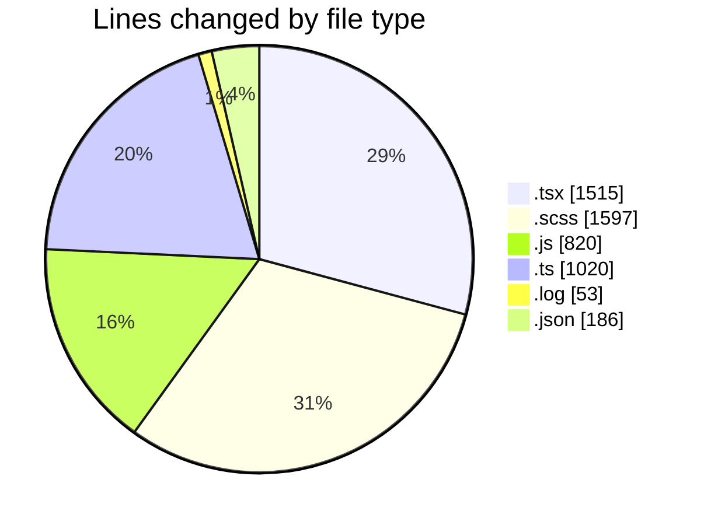
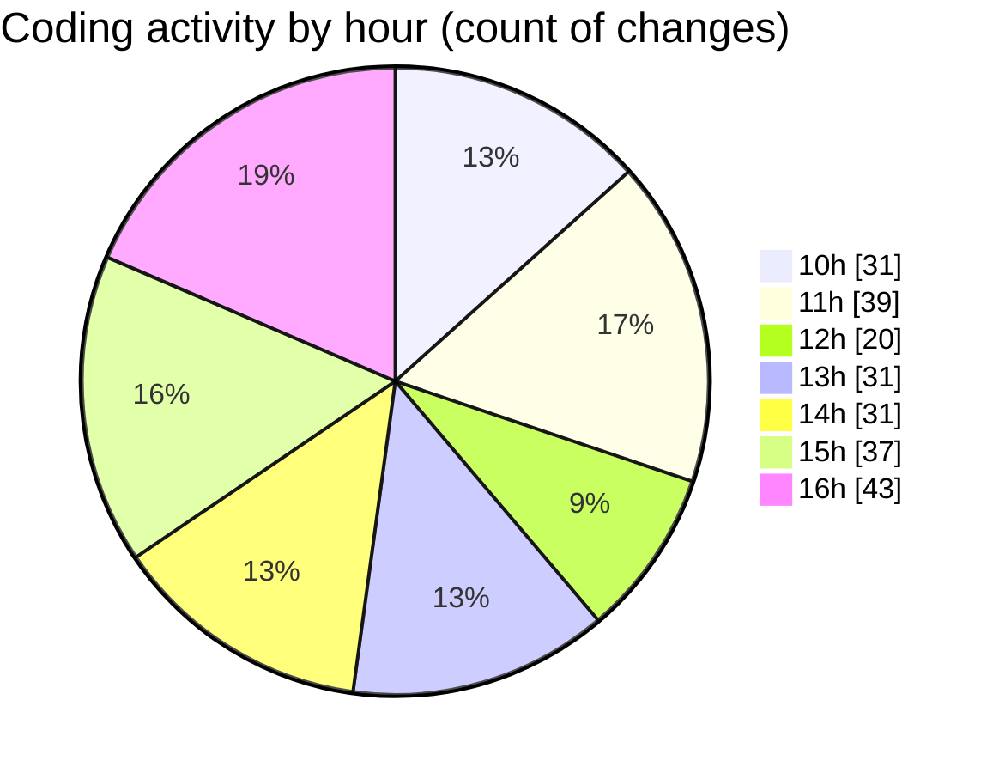

# cda - Activity Summary 

## Overall Statistics

| Stat                   | Value                                                             |
| ---------------------- | ----------------------------------------------------------------- |
| **Lines Added** (➕)   | 3437                                          |
| **Lines Removed** (➖) | 1754                                        |
| **Net Change** (↕)    | 1683                |
| **Active Time** (⌚)   | 297 minutes |

## Modified Files
- **Tooltip.tsx** (+791, -616)
- **tooltip.scss** (+845, -752)
- **Tooltip.stories.js** (+141, -3)
- **tooltipPositioning.ts** (+350, -145)
- **profileFieldsConfig.ts** (+509, -16)
- **debug-storybook.log** (+27, -26)
- **AttachmentDetailsPanel.test.tsx** (+103, -5)
- **peopleview.js** (+485, -191)
- **package.json** (+186, -0)

## Visualizations

### By File Type (Lines Changed)

### By Hour (Estimated Activity Count)

> **Last Updated:** 25/03/2026, 17:02:35