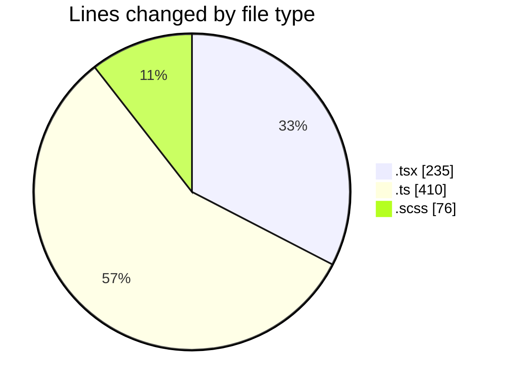

# cda - Activity Summary 

## Overall Statistics

| Stat                   | Value                                                             |
| ---------------------- | ----------------------------------------------------------------- |
| **Lines Added** (➕)   | 392                                          |
| **Lines Removed** (➖) | 329                                        |
| **Net Change** (↕)    | 63                |
| **Active Time** (⌚)   | 113 minutes |

## Modified Files
- **Tooltip.tsx** (+115, -120)
- **tooltipPositioning copy.ts** (+205, -184)
- **getClippingContainer.ts** (+21, -0)
- **tooltip.scss** (+51, -25)

## Visualizations

### By File Type (Lines Changed)

### By Hour (Estimated Activity Count)

> **Last Updated:** 26/03/2026, 17:52:46