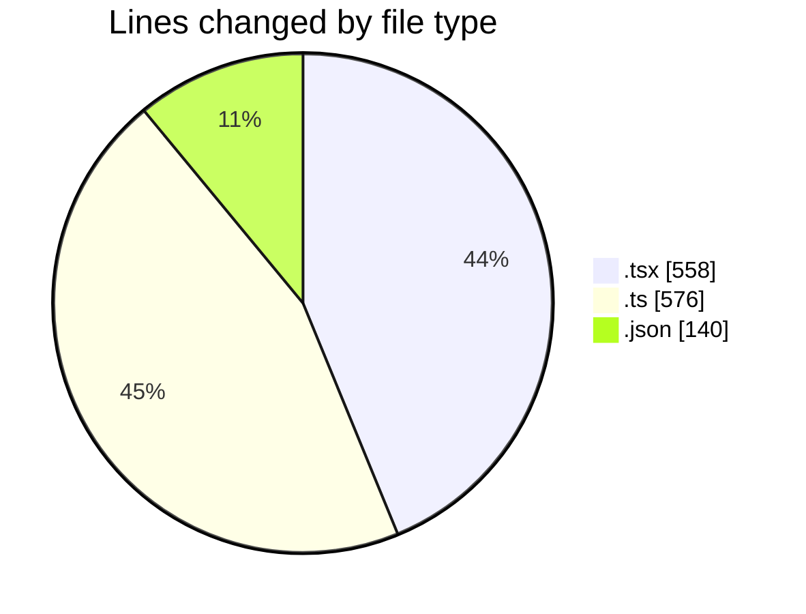
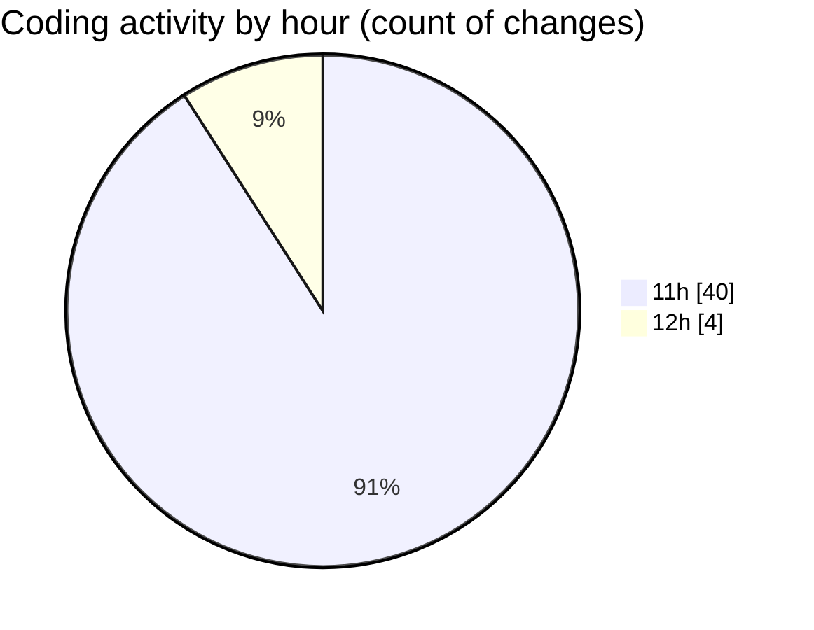

# cda - Activity Summary 

## Overall Statistics

| Stat                   | Value                                                             |
| ---------------------- | ----------------------------------------------------------------- |
| **Lines Added** (➕)   | 1113                                          |
| **Lines Removed** (➖) | 161                                        |
| **Net Change** (↕)    | 952                |
| **Active Time** (⌚)   | 54 minutes |

## Modified Files
- **Tooltip.test.tsx** (+251, -8)
- **tooltipPositionin.test.ts** (+316, -151)
- **getClippingContaine.test.ts** (+108, -1)
- **package.json** (+66, -1)
- **ConstructDefinitionListItem.tsx** (+76, -0)
- **package.json** (+73, -0)
- **CondensedFaultTable.tsx** (+223, -0)

## Visualizations

### By File Type (Lines Changed)

### By Hour (Estimated Activity Count)

> **Last Updated:** 27/03/2026, 12:42:47