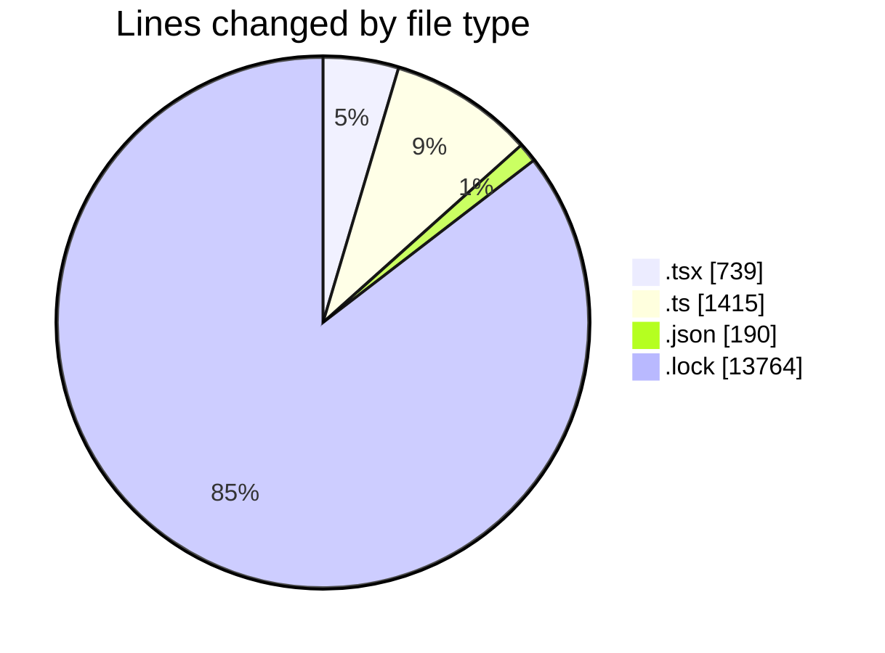
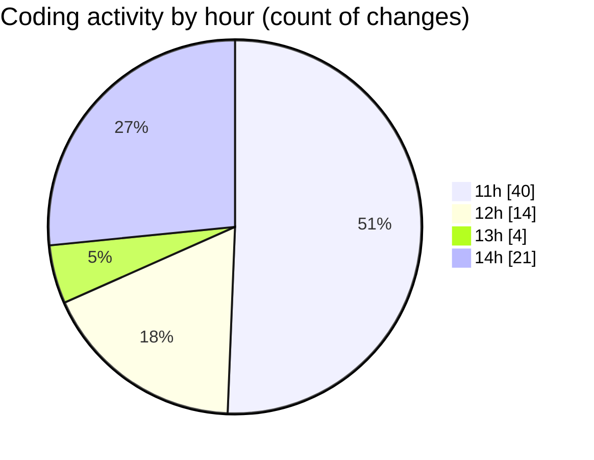

# cda - Activity Summary 

## Overall Statistics

| Stat                   | Value                                                             |
| ---------------------- | ----------------------------------------------------------------- |
| **Lines Added** (➕)   | 15912                                          |
| **Lines Removed** (➖) | 196                                        |
| **Net Change** (↕)    | 15716                |
| **Active Time** (⌚)   | 106 minutes |

## Modified Files
- **Tooltip.test.tsx** (+251, -8)
- **tooltipPositionin.test.ts** (+316, -151)
- **getClippingContaine.test.ts** (+108, -1)
- **package.json** (+66, -1)
- **ConstructDefinitionListItem.tsx** (+76, -0)
- **package.json** (+73, -0)
- **CondensedFaultTable.tsx** (+237, -17)
- **FaultCodeToolTip.tsx** (+42, -10)
- **EndCodeToolTip.tsx** (+40, -8)
- **index.ts** (+448, -0)
- **index.d.ts** (+391, -0)
- **Tooltip.tsx** (+50, -0)
- **package.json** (+50, -0)
- **yarn.lock** (+13764, -0)

## Visualizations

### By File Type (Lines Changed)

### By Hour (Estimated Activity Count)

> **Last Updated:** 27/03/2026, 14:57:47