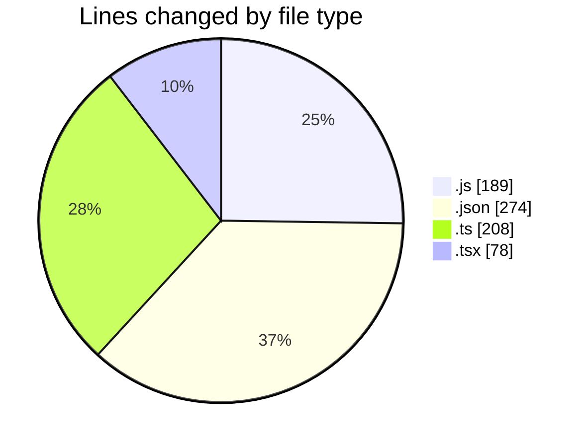
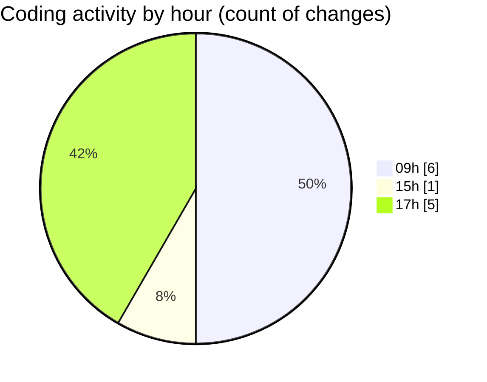

# cda - Activity Summary 

## Overall Statistics

| Stat                   | Value                                                             |
| ---------------------- | ----------------------------------------------------------------- |
| **Lines Added** (➕)   | 721                                          |
| **Lines Removed** (➖) | 28                                        |
| **Net Change** (↕)    | 693                |
| **Active Time** (⌚)   | 6 minutes |

## Modified Files
- **Tooltip.stories.js** (+163, -26)
- **package.json** (+73, -0)
- **package.json** (+66, -0)
- **package.json** (+56, -0)
- **package.json** (+79, -0)
- **fieldUtils.ts** (+206, -2)
- **ConstructDefinitionListItem.tsx** (+78, -0)

## Visualizations

### By File Type (Lines Changed)

### By Hour (Estimated Activity Count)

> **Last Updated:** 07/04/2026, 17:14:46