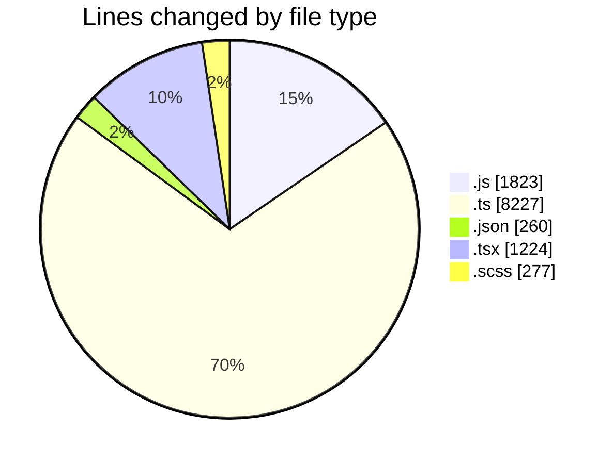
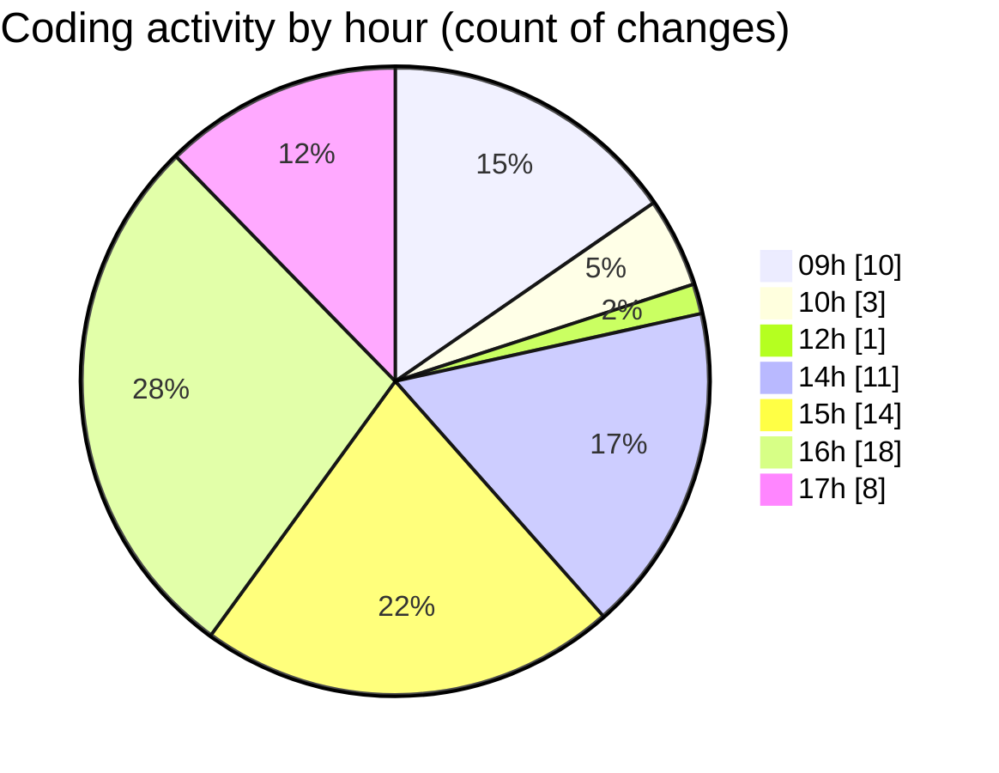

# cda - Activity Summary 

## Overall Statistics

| Stat                   | Value                                                             |
| ---------------------- | ----------------------------------------------------------------- |
| **Lines Added** (➕)   | 11335                                          |
| **Lines Removed** (➖) | 476                                        |
| **Net Change** (↕)    | 10859                |
| **Active Time** (⌚)   | 91 minutes |

## Modified Files
- **peopleview-queries.js** (+1472, -2)
- **20260407162117-replace-poepleview-profile-view.js** (+143, -2)
- **20260407161530-replace-peopleview-teams-view.js** (+63, -0)
- **20260407154938-replace-peopleview-profiles-view.js** (+141, -0)
- **sap_views.ts** (+1639, -0)
- **tables.ts** (+6585, -0)
- **package.json** (+186, -0)
- **DescriptionList.stories.tsx** (+200, -138)
- **index.ts** (+3, -0)
- **DescriptionList.tsx** (+242, -161)
- **settings.json** (+74, -0)
- **DescriptionItem.tsx** (+107, -68)
- **DescriptionList.scss** (+172, -105)
- **PublicDetailsPanel.tsx** (+183, -0)
- **ConstructDefinitionListItem.tsx** (+76, -0)
- **ConstructFieldContent.tsx** (+49, -0)

## Visualizations

### By File Type (Lines Changed)

### By Hour (Estimated Activity Count)

> **Last Updated:** 08/04/2026, 17:37:22