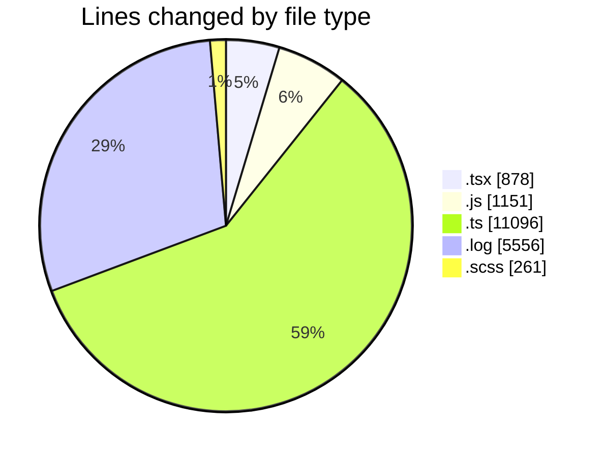
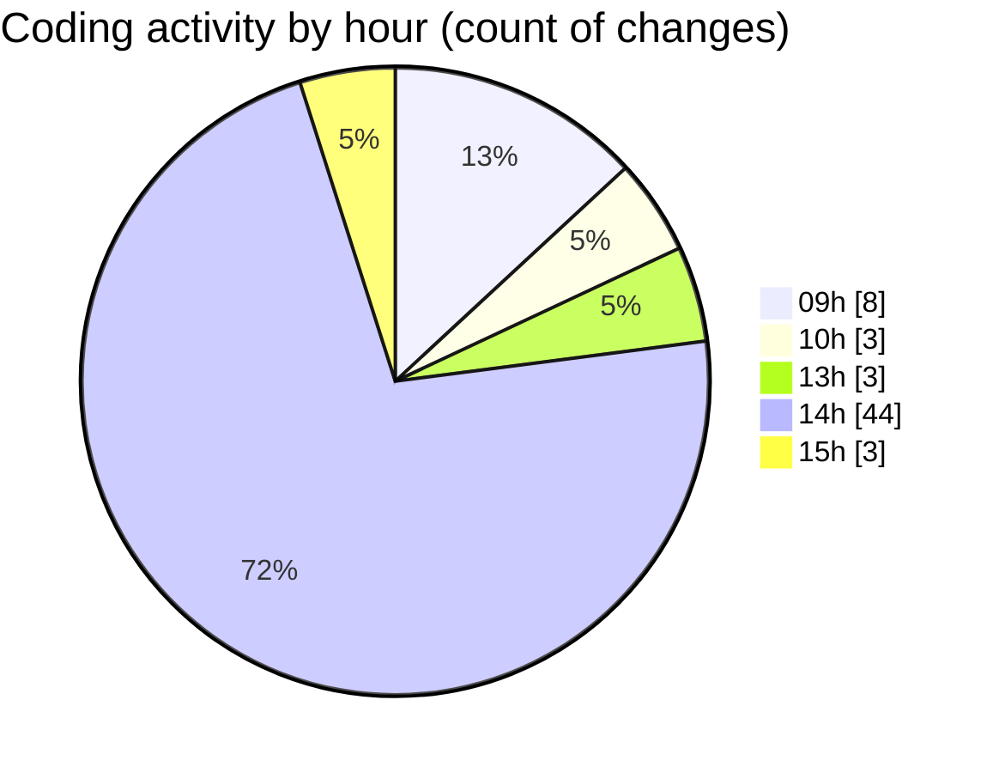

# cda - Activity Summary 

## Overall Statistics

| Stat                   | Value                                                             |
| ---------------------- | ----------------------------------------------------------------- |
| **Lines Added** (➕)   | 16405                                          |
| **Lines Removed** (➖) | 2537                                        |
| **Net Change** (↕)    | 13868                |
| **Active Time** (⌚)   | 104 minutes |

## Modified Files
- **MyTeam.tsx** (+213, -4)
- **20260409084739-replace-peopleview-teams-view.js** (+75, -0)
- **20260407162117-replace-poepleview-profile-view.js** (+141, -0)
- **peopleview-queries.js** (+835, -100)
- **ConstructFieldContent.tsx** (+48, -0)
- **resolvers-types.ts** (+11096, -0)
- **debug-storybook.log** (+3334, -2222)
- **DescriptionList.test.tsx** (+54, -44)
- **DescriptionList.scss** (+143, -79)
- **_base.scss** (+39, -0)
- **DescriptionList.stories.tsx** (+227, -88)
- **PageHeading.stories.tsx** (+200, -0)

## Visualizations

### By File Type (Lines Changed)

### By Hour (Estimated Activity Count)

> **Last Updated:** 09/04/2026, 15:16:31