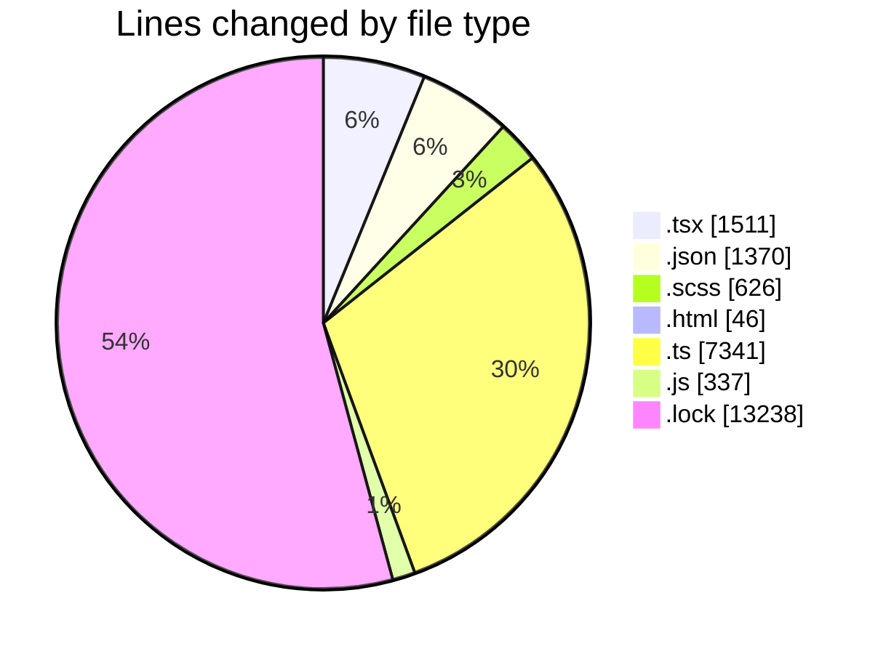
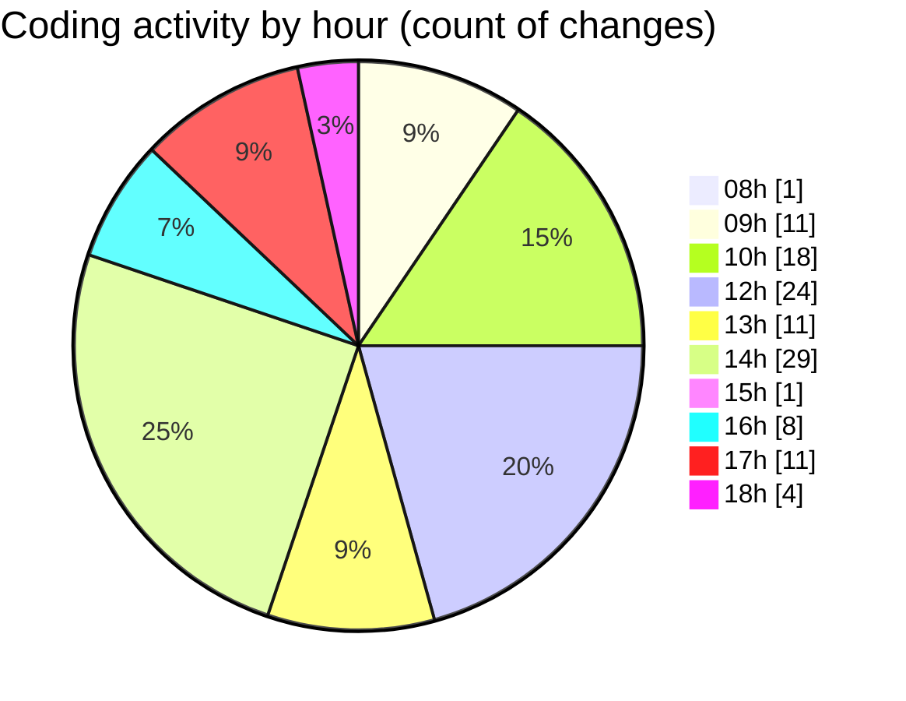

# cda - Activity Summary 

## Overall Statistics

| Stat                   | Value                                                             |
| ---------------------- | ----------------------------------------------------------------- |
| **Lines Added** (➕)   | 24333                                          |
| **Lines Removed** (➖) | 136                                        |
| **Net Change** (↕)    | 24197                |
| **Active Time** (⌚)   | 135 minutes |

## Modified Files
- **App.tsx** (+45, -0)
- **package.json** (+930, -0)
- **package.json** (+332, -2)
- **PersonCardLarge.tsx** (+77, -0)
- **package.json** (+62, -0)
- **Panel.scss** (+4, -0)
- **index.scss** (+3, -0)
- **index.html** (+46, -0)
- **tsconfig.json** (+23, -0)
- **Lds.test.tsx** (+45, -31)
- **manifest.json** (+21, -0)
- **ProfileFields.tsx** (+87, -16)
- **index.d.ts** (+4371, -0)
- **index.ts** (+2113, -39)
- **index.d.ts** (+818, -0)
- **SearchBanners.test.tsx** (+152, -0)
- **index.js** (+337, -0)
- **DescriptionList.scss** (+214, -27)
- **TreeLeaf.scss** (+124, -0)
- **ProfilePublic.scss** (+176, -0)
- **DescriptionList.stories.tsx** (+237, -0)
- **DescriptionItem.tsx** (+41, -0)
- **DescriptionList.tsx** (+83, -0)
- **PersonalDetailsPanel.scss** (+14, -0)
- **PersonalDetailsPanel.tsx** (+185, -4)
- **PublicDetailsPanel.scss** (+64, -0)
- **PublicDetailsPanel.tsx** (+183, -0)
- **ProfilePublic.tsx** (+200, -0)
- **ConstructDefinitionListItem.tsx** (+93, -17)
- **yarn.lock** (+13238, -0)
- **Lds.tsx** (+15, -0)

## Visualizations

### By File Type (Lines Changed)

### By Hour (Estimated Activity Count)

> **Last Updated:** 14/04/2026, 18:27:21