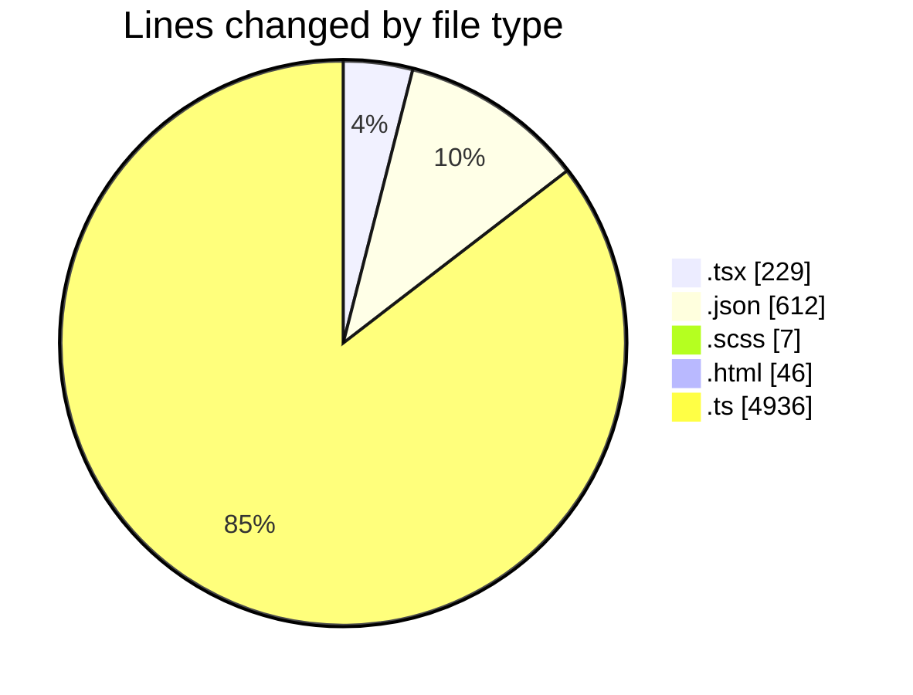
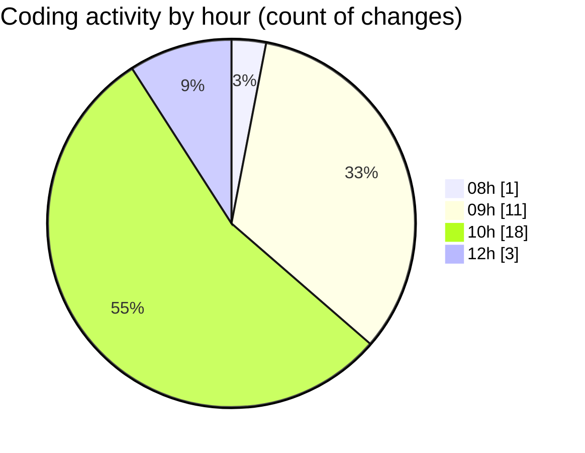

# cda - Activity Summary 

## Overall Statistics

| Stat                   | Value                                                             |
| ---------------------- | ----------------------------------------------------------------- |
| **Lines Added** (➕)   | 5777                                          |
| **Lines Removed** (➖) | 53                                        |
| **Net Change** (↕)    | 5724                |
| **Active Time** (⌚)   | 43 minutes |

## Modified Files
- **App.tsx** (+45, -0)
- **package.json** (+372, -0)
- **package.json** (+133, -1)
- **PersonCardLarge.tsx** (+77, -0)
- **package.json** (+62, -0)
- **Panel.scss** (+4, -0)
- **index.scss** (+3, -0)
- **index.html** (+46, -0)
- **tsconfig.json** (+23, -0)
- **Lds.test.tsx** (+45, -31)
- **manifest.json** (+21, -0)
- **ProfileFields.tsx** (+28, -3)
- **index.d.ts** (+4371, -0)
- **index.ts** (+547, -18)

## Visualizations

### By File Type (Lines Changed)

### By Hour (Estimated Activity Count)

> **Last Updated:** 14/04/2026, 12:13:24