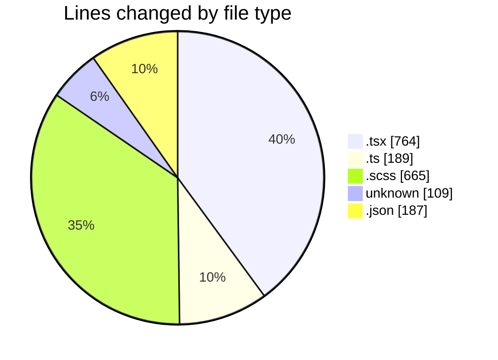
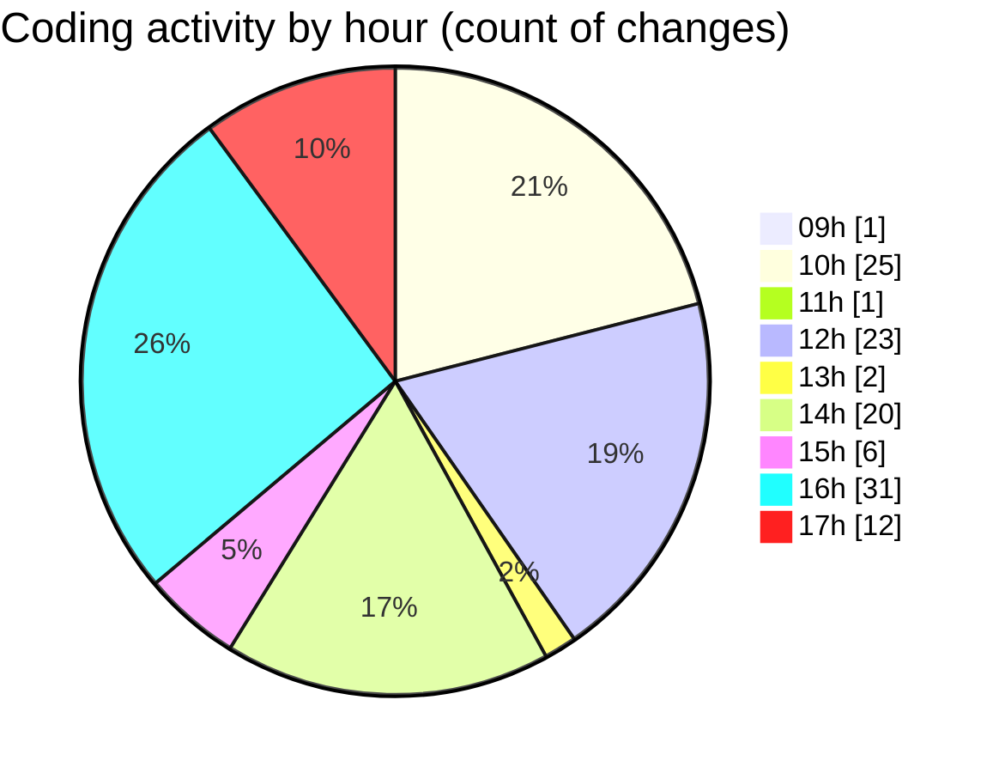

# cda - Activity Summary 

## Overall Statistics

| Stat                   | Value                                                             |
| ---------------------- | ----------------------------------------------------------------- |
| **Lines Added** (➕)   | 1795                                          |
| **Lines Removed** (➖) | 119                                        |
| **Net Change** (↕)    | 1676                |
| **Active Time** (⌚)   | 161 minutes |

## Modified Files
- **Lds.tsx** (+6, -8)
- **SearchLds.tsx** (+41, -11)
- **index.ts** (+3, -0)
- **SearchLds.test.tsx** (+14, -0)
- **App.tsx** (+45, -1)
- **SearchLds.scss** (+7, -3)
- **Lds.test.tsx** (+13, -0)
- **.env** (+109, -0)
- **queries.ts** (+78, -1)
- **mutations.ts** (+90, -17)
- **package.json** (+0, -1)
- **package.json** (+186, -0)
- **DescriptionList.scss** (+606, -49)
- **DescriptionList.stories.tsx** (+514, -28)
- **DescriptionList.tsx** (+83, -0)

## Visualizations

### By File Type (Lines Changed)

### By Hour (Estimated Activity Count)

> **Last Updated:** 15/04/2026, 17:20:52