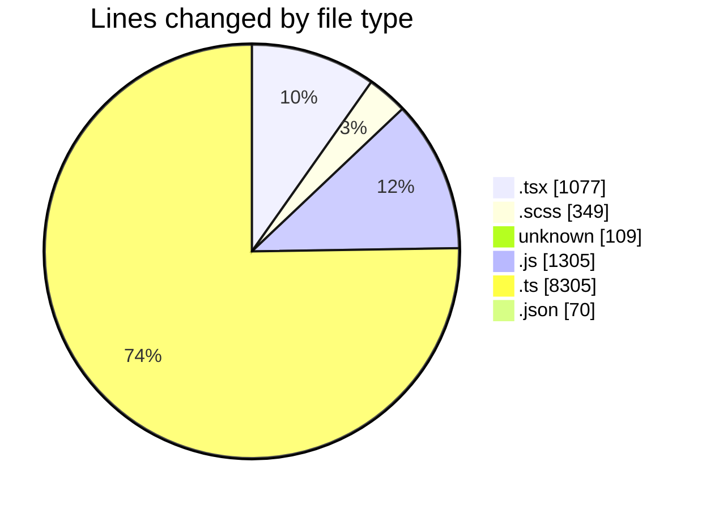
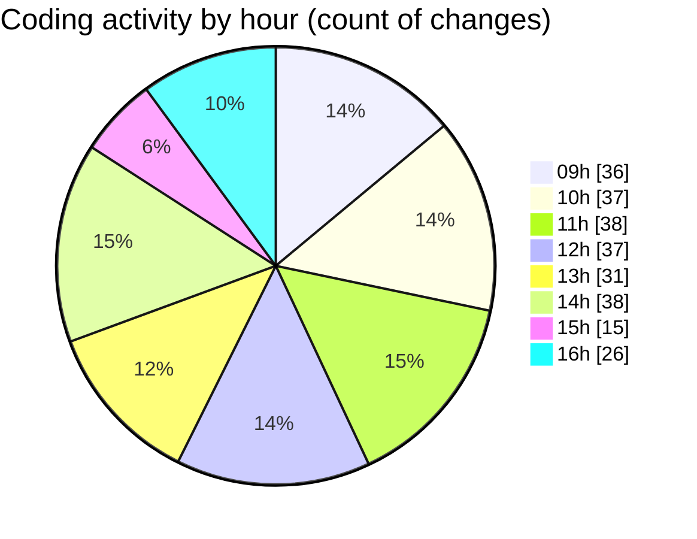

# cda - Activity Summary 

## Overall Statistics

| Stat                   | Value                                                             |
| ---------------------- | ----------------------------------------------------------------- |
| **Lines Added** (➕)   | 10786                                          |
| **Lines Removed** (➖) | 429                                        |
| **Net Change** (↕)    | 10357                |
| **Active Time** (⌚)   | 395 minutes |

## Modified Files
- **DescriptionListItem.tsx** (+67, -19)
- **DescriptionList.scss** (+99, -74)
- **DescriptionList.stories.tsx** (+344, -220)
- **DescriptionList.tsx** (+21, -14)
- **.env** (+109, -0)
- **20260407162117-replace-poepleview-profile-view.js** (+144, -3)
- **peopleview-queries.js** (+795, -60)
- **20260409084739-replace-peopleview-teams-view.js** (+78, -3)
- **20260416145412-replace-poepleview-profile-view.js** (+144, -0)
- **20260416145438-replace-peopleview-teams-view.js** (+78, -0)
- **tables.ts** (+6608, -23)
- **sap_views.ts** (+1674, -0)
- **SearchBanners.test.tsx** (+86, -5)
- **package.json** (+68, -2)
- **ProfilePublic.scss** (+176, -0)
- **PublicDetailsPanel.tsx** (+183, -0)
- **ProfileLabel.tsx** (+12, -0)
- **ConstructDefinitionListItem.tsx** (+100, -6)

## Visualizations

### By File Type (Lines Changed)

### By Hour (Estimated Activity Count)

> **Last Updated:** 16/04/2026, 16:44:01