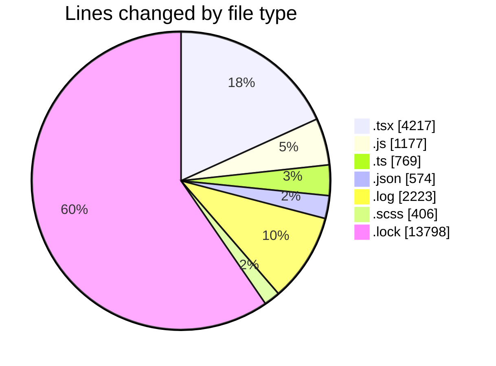
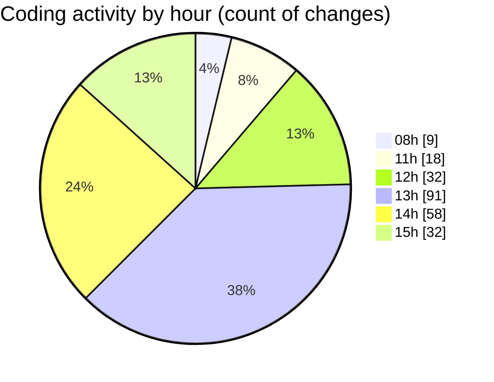

# cda - Activity Summary 

## Overall Statistics

| Stat                   | Value                                                             |
| ---------------------- | ----------------------------------------------------------------- |
| **Lines Added** (➕)   | 20928                                          |
| **Lines Removed** (➖) | 2236                                        |
| **Net Change** (↕)    | 18692                |
| **Active Time** (⌚)   | 297 minutes |

## Modified Files
- **ConstructDefinitionListItem.tsx** (+312, -141)
- **ProfileFields.tsx** (+78, -30)
- **peopleview-queries.js** (+795, -60)
- **SearchBanners.test.tsx** (+96, -15)
- **20260416145412-replace-poepleview-profile-view.js** (+0, -2)
- **20260416145438-replace-peopleview-teams-view.js** (+0, -3)
- **sap_views.ts** (+0, -6)
- **tables.ts** (+23, -23)
- **package.json** (+372, -0)
- **PublicDetailsPanel.tsx** (+366, -1)
- **ProfileLabel.tsx** (+34, -8)
- **package.json** (+132, -0)
- **debug-storybook.log** (+1112, -1111)
- **20260407162117-replace-poepleview-profile-view.js** (+141, -0)
- **ConstructFieldContent.tsx** (+60, -12)
- **ProfilePublic.scss** (+178, -2)
- **fieldUtils.ts** (+204, -0)
- **ConstructFieldRows.tsx** (+28, -5)
- **PersonalDetailsPanel.tsx** (+325, -141)
- **ConstructDefinitionListItem.test.tsx** (+86, -0)
- **CancelBooking.tsx** (+89, -24)
- **ConfirmationModal.tsx** (+121, -0)
- **App.tsx** (+70, -6)
- **yarn.lock** (+13613, -185)
- **index.js** (+173, -3)
- **index.ts** (+511, -2)
- **DescriptionList.scss** (+201, -1)
- **EmploymentDetailsPanel.tsx** (+66, -13)
- **HoursAndPayPanel.tsx** (+84, -15)
- **GenderPayPanel.tsx** (+250, -112)
- **EthnicityPayPanel.tsx** (+198, -87)
- **PayTransparencyContainer.tsx** (+164, -2)
- **Panels.scss** (+21, -3)
- **DisabilityPayPanel.tsx** (+122, -22)
- **BankDetailsPanel.tsx** (+157, -59)
- **EmergencyContactPanel.tsx** (+121, -62)
- **NextOfKinPanel.tsx** (+72, -15)
- **package.json** (+70, -0)
- **Book.tsx** (+483, -65)

## Visualizations

### By File Type (Lines Changed)

### By Hour (Estimated Activity Count)

> **Last Updated:** 17/04/2026, 15:37:01