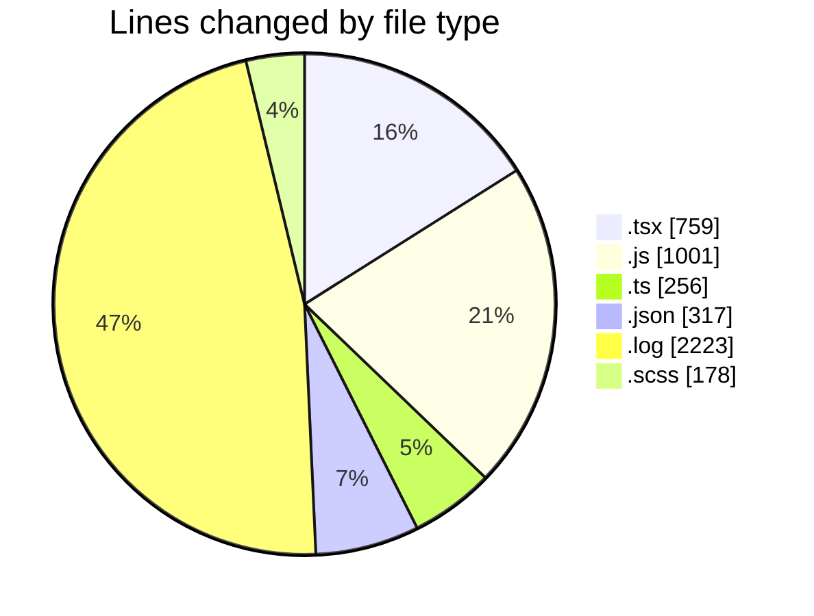
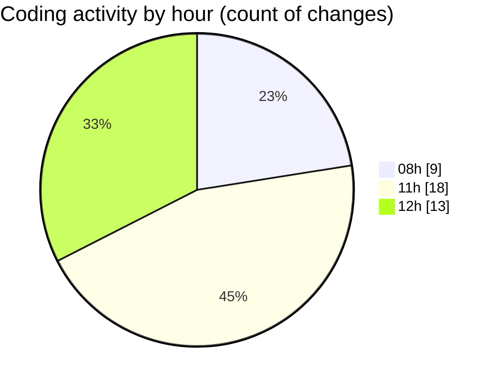

# cda - Activity Summary 

## Overall Statistics

| Stat                   | Value                                                             |
| ---------------------- | ----------------------------------------------------------------- |
| **Lines Added** (➕)   | 3497                                          |
| **Lines Removed** (➖) | 1237                                        |
| **Net Change** (↕)    | 2260                |
| **Active Time** (⌚)   | 43 minutes |

## Modified Files
- **ConstructDefinitionListItem.tsx** (+190, -21)
- **ProfileFields.tsx** (+54, -6)
- **peopleview-queries.js** (+795, -60)
- **SearchBanners.test.tsx** (+5, -5)
- **20260416145412-replace-poepleview-profile-view.js** (+0, -2)
- **20260416145438-replace-peopleview-teams-view.js** (+0, -3)
- **sap_views.ts** (+0, -6)
- **tables.ts** (+23, -23)
- **package.json** (+186, -0)
- **PublicDetailsPanel.tsx** (+366, -0)
- **ProfileLabel.tsx** (+26, -0)
- **package.json** (+131, -0)
- **debug-storybook.log** (+1112, -1111)
- **20260407162117-replace-poepleview-profile-view.js** (+141, -0)
- **ConstructFieldContent.tsx** (+58, -0)
- **ProfilePublic.scss** (+178, -0)
- **fieldUtils.ts** (+204, -0)
- **ConstructFieldRows.tsx** (+28, -0)

## Visualizations

### By File Type (Lines Changed)

### By Hour (Estimated Activity Count)

> **Last Updated:** 17/04/2026, 12:37:01