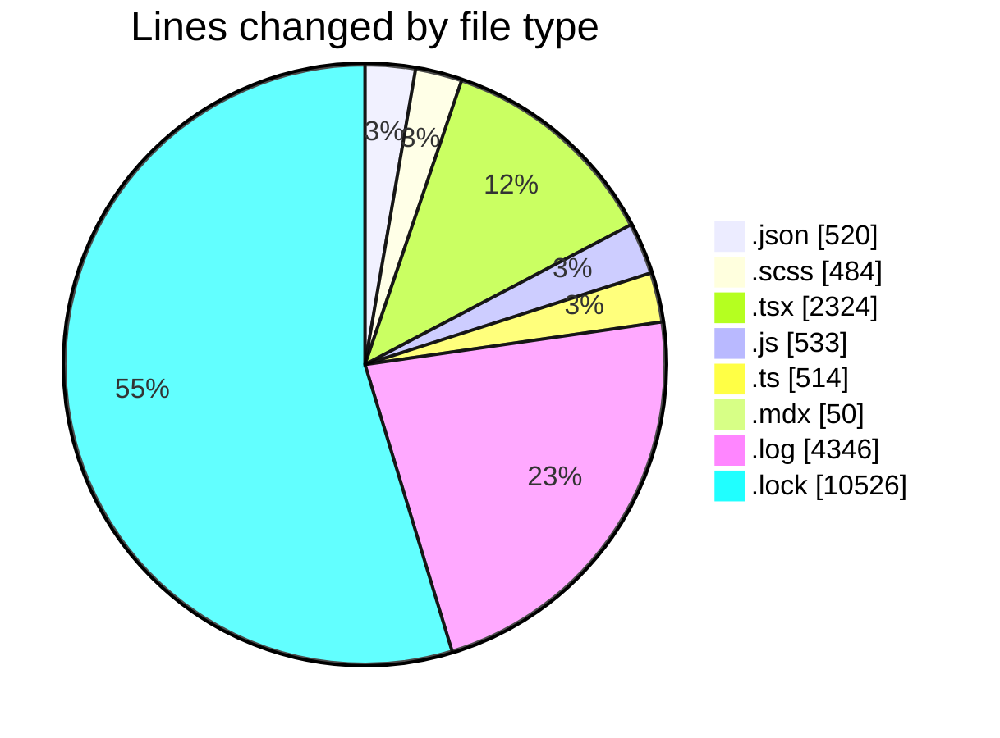
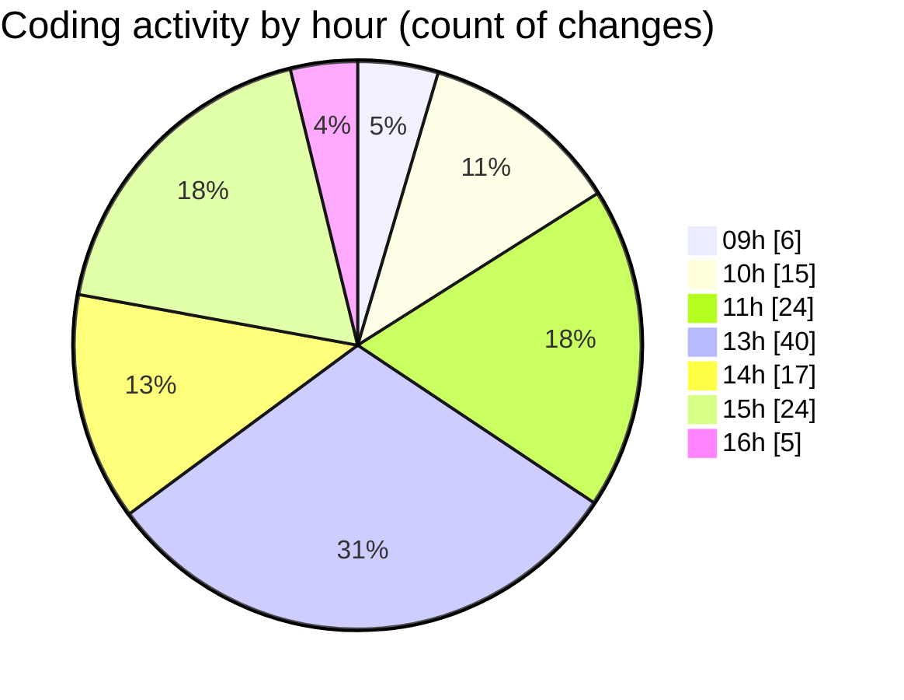

# cda - Activity Summary 

## Overall Statistics

| Stat                   | Value                                                             |
| ---------------------- | ----------------------------------------------------------------- |
| **Lines Added** (➕)   | 16712                                          |
| **Lines Removed** (➖) | 2585                                        |
| **Net Change** (↕)    | 14127                |
| **Active Time** (⌚)   | 184 minutes |

## Modified Files
- **package.json** (+66, -0)
- **package.json** (+74, -6)
- **DescriptionList.scss** (+265, -125)
- **package.json** (+373, -1)
- **PublicDetailsPanel.tsx** (+183, -0)
- **PersonalDetailsPanel.tsx** (+181, -0)
- **DescriptionList.tsx** (+109, -0)
- **DescriptionList.stories.tsx** (+417, -41)
- **EmploymentDetailsPanel.tsx** (+42, -0)
- **Tooltip.stories.js** (+189, -52)
- **index.ts** (+509, -2)
- **Tooltip.scss** (+45, -0)
- **Tooltip.mdx** (+50, -0)
- **index.js** (+167, -22)
- **Tooltip.tsx** (+305, -155)
- **tooltip.test.js** (+103, -0)
- **NotFound.tsx** (+53, -0)
- **Tooltip.test.tsx** (+377, -37)
- **Tooltip.stories.tsx** (+423, -1)
- **debug-storybook.log** (+2203, -2143)
- **index.ts** (+3, -0)
- **yarn.lock** (+10526, -0)
- **_demo.scss** (+49, -0)

## Visualizations

### By File Type (Lines Changed)

### By Hour (Estimated Activity Count)

> **Last Updated:** 20/04/2026, 16:11:32