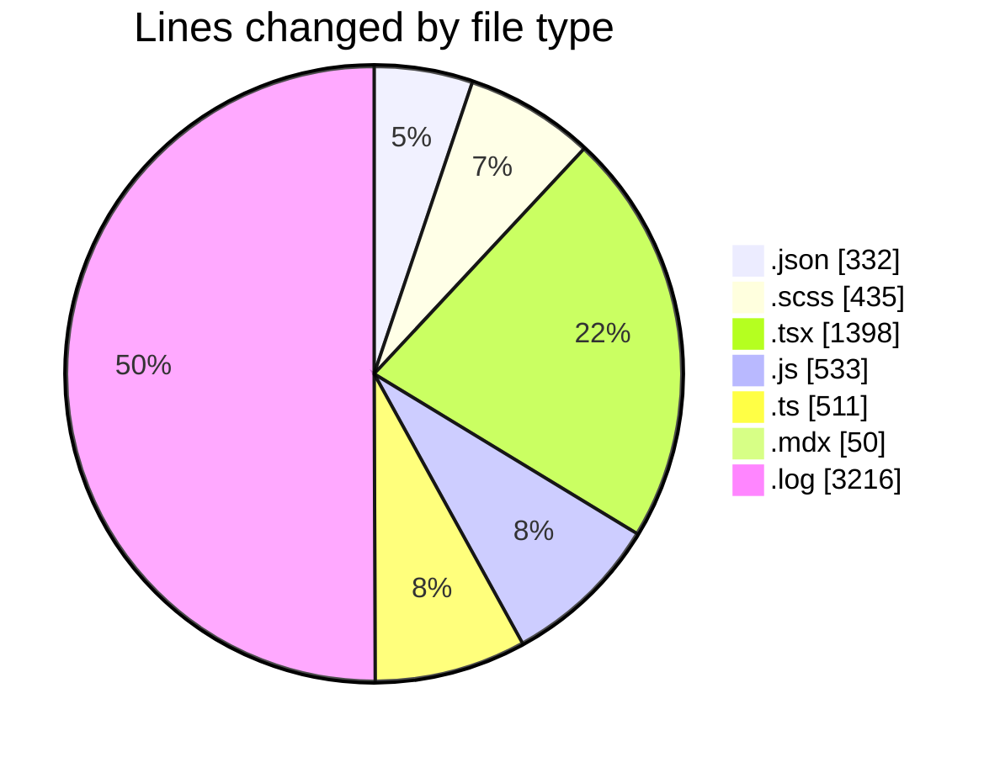
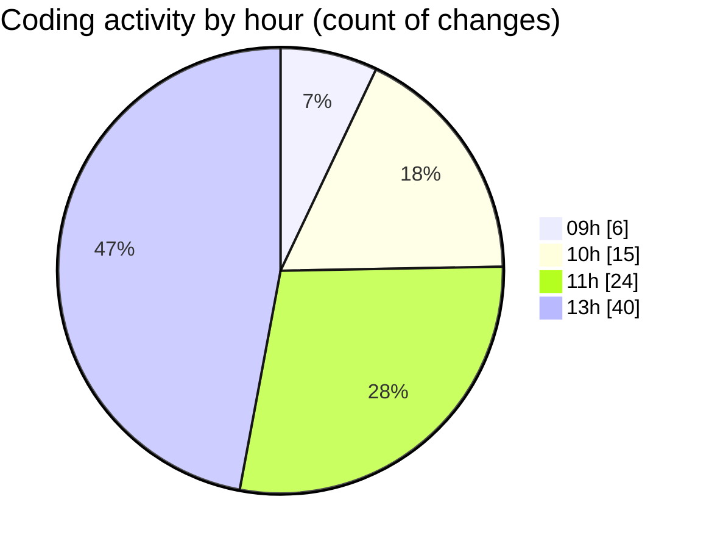

# cda - Activity Summary 

## Overall Statistics

| Stat                   | Value                                                             |
| ---------------------- | ----------------------------------------------------------------- |
| **Lines Added** (➕)   | 5134                                          |
| **Lines Removed** (➖) | 1341                                        |
| **Net Change** (↕)    | 3793                |
| **Active Time** (⌚)   | 129 minutes |

## Modified Files
- **package.json** (+66, -0)
- **package.json** (+74, -6)
- **DescriptionList.scss** (+265, -125)
- **package.json** (+186, -0)
- **PublicDetailsPanel.tsx** (+183, -0)
- **PersonalDetailsPanel.tsx** (+181, -0)
- **DescriptionList.tsx** (+109, -0)
- **DescriptionList.stories.tsx** (+417, -41)
- **EmploymentDetailsPanel.tsx** (+42, -0)
- **Tooltip.stories.js** (+189, -52)
- **index.ts** (+509, -2)
- **Tooltip.scss** (+45, -0)
- **Tooltip.mdx** (+50, -0)
- **index.js** (+167, -22)
- **Tooltip.tsx** (+96, -20)
- **tooltip.test.js** (+103, -0)
- **NotFound.tsx** (+53, -0)
- **Tooltip.test.tsx** (+103, -0)
- **Tooltip.stories.tsx** (+152, -1)
- **debug-storybook.log** (+2144, -1072)

## Visualizations

### By File Type (Lines Changed)

### By Hour (Estimated Activity Count)

> **Last Updated:** 20/04/2026, 13:59:07