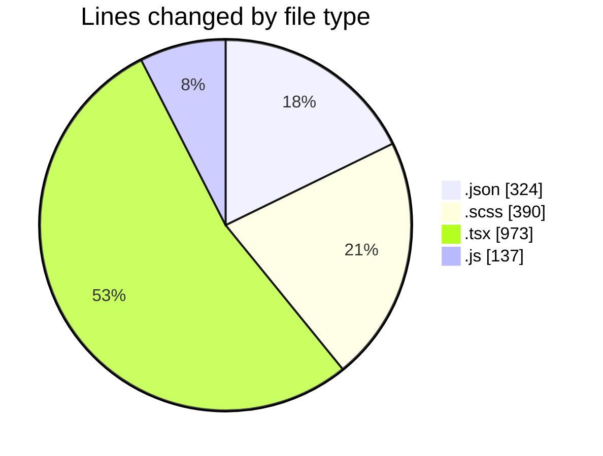
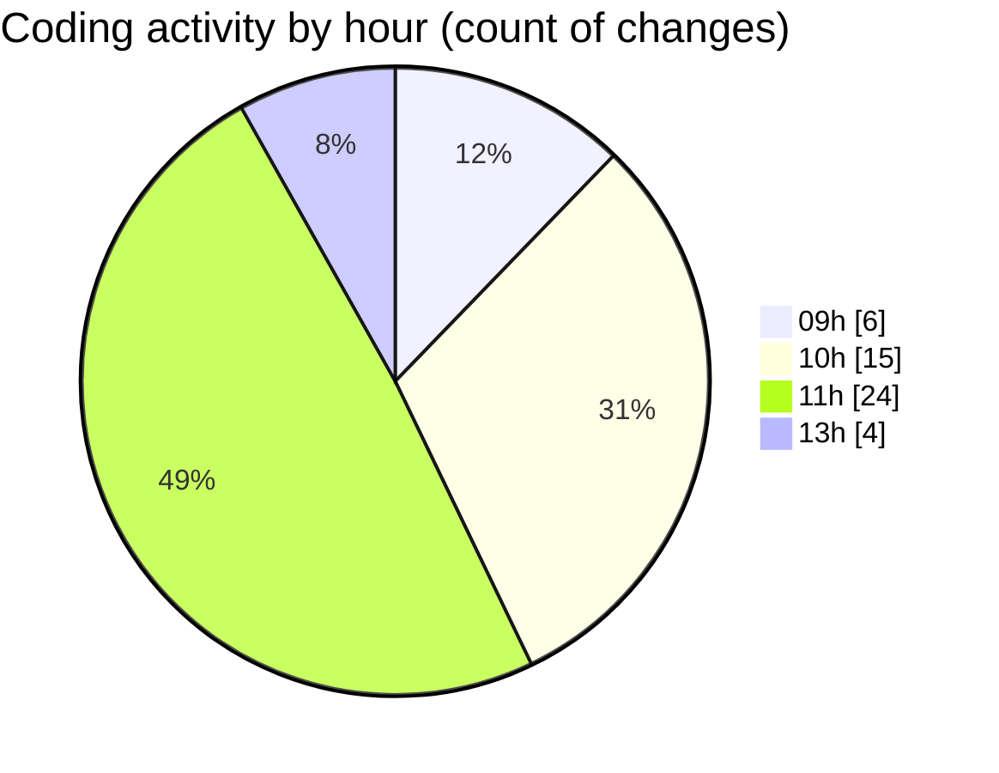

# cda - Activity Summary 

## Overall Statistics

| Stat                   | Value                                                             |
| ---------------------- | ----------------------------------------------------------------- |
| **Lines Added** (➕)   | 1657                                          |
| **Lines Removed** (➖) | 167                                        |
| **Net Change** (↕)    | 1490                |
| **Active Time** (⌚)   | 74 minutes |

## Modified Files
- **package.json** (+66, -0)
- **package.json** (+71, -1)
- **DescriptionList.scss** (+265, -125)
- **package.json** (+186, -0)
- **PublicDetailsPanel.tsx** (+183, -0)
- **PersonalDetailsPanel.tsx** (+181, -0)
- **DescriptionList.tsx** (+109, -0)
- **DescriptionList.stories.tsx** (+417, -41)
- **EmploymentDetailsPanel.tsx** (+42, -0)
- **Tooltip.stories.js** (+137, -0)

## Visualizations

### By File Type (Lines Changed)

### By Hour (Estimated Activity Count)

> **Last Updated:** 20/04/2026, 13:24:07