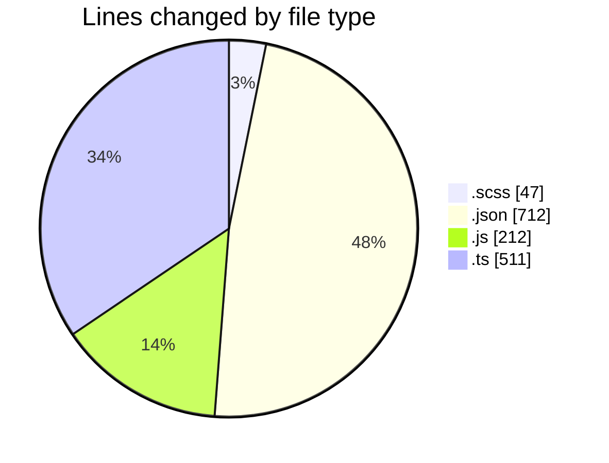
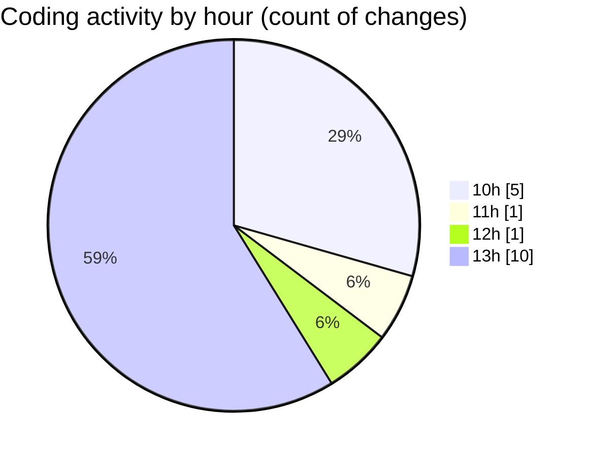

# cda - Activity Summary 

## Overall Statistics

| Stat                   | Value                                                             |
| ---------------------- | ----------------------------------------------------------------- |
| **Lines Added** (➕)   | 1478                                          |
| **Lines Removed** (➖) | 4                                        |
| **Net Change** (↕)    | 1474                |
| **Active Time** (⌚)   | 9 minutes |

## Modified Files
- **Tooltip.scss** (+46, -1)
- **package.json** (+372, -0)
- **vitest.config.js** (+39, -3)
- **package.json** (+66, -0)
- **package.json** (+88, -0)
- **package.json** (+51, -0)
- **package.json** (+66, -0)
- **package.json** (+69, -0)
- **index.ts** (+511, -0)
- **index.js** (+170, -0)

## Visualizations

### By File Type (Lines Changed)

### By Hour (Estimated Activity Count)

> **Last Updated:** 21/04/2026, 13:07:26