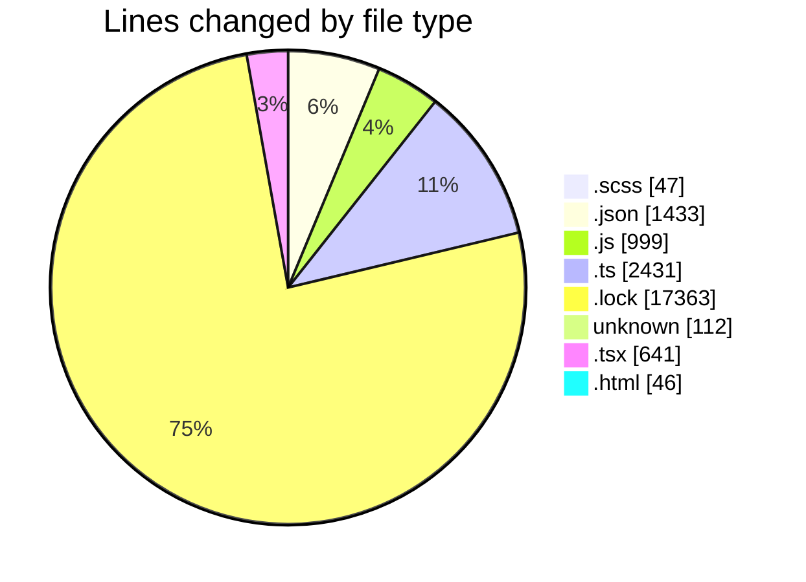
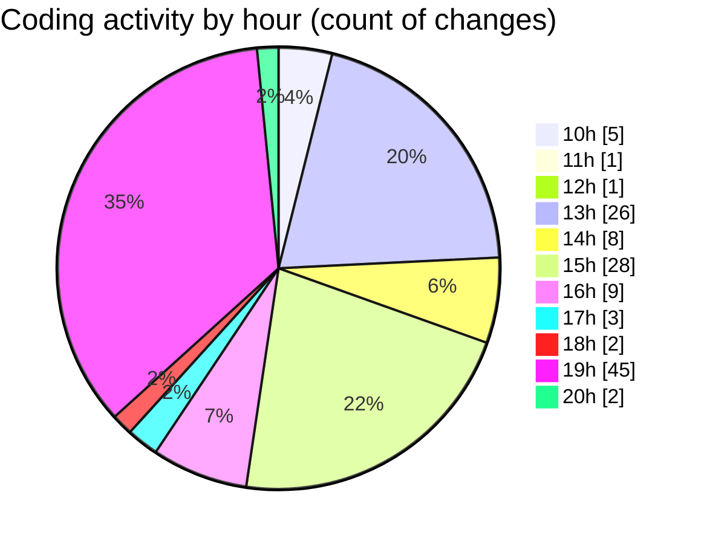

# cda - Activity Summary 

## Overall Statistics

| Stat                   | Value                                                             |
| ---------------------- | ----------------------------------------------------------------- |
| **Lines Added** (➕)   | 22893                                          |
| **Lines Removed** (➖) | 179                                        |
| **Net Change** (↕)    | 22714                |
| **Active Time** (⌚)   | 132 minutes |

## Modified Files
- **Tooltip.scss** (+46, -1)
- **package.json** (+558, -0)
- **vitest.config.js** (+75, -3)
- **package.json** (+66, -0)
- **package.json** (+88, -0)
- **package.json** (+51, -0)
- **package.json** (+66, -0)
- **package.json** (+69, -0)
- **index.ts** (+1018, -0)
- **index.js** (+337, -0)
- **lambda-policy.json** (+126, -0)
- **oracle-configs.d.ts** (+3, -0)
- **lambda.json** (+195, -0)
- **index.ts** (+403, -0)
- **yarn.lock** (+17356, -7)
- **OracleProcessor.js** (+8, -0)
- **OracleProcessor.ts** (+17, -0)
- **graphql.ts** (+236, -0)
- **CSVReader.js** (+83, -0)
- **oracle-configs.js** (+22, -0)
- **OracleGrammar.js** (+55, -0)
- **OracleGrammar.ts** (+79, -0)
- **OracleGrammar.test.ts** (+178, -0)
- **oracle-configs.ts** (+31, -0)
- **.env** (+112, -0)
- **UserProvider.js** (+53, -5)
- **App.js** (+269, -0)
- **UserProvider.js** (+89, -0)
- **App.tsx** (+44, -0)
- **index.html** (+46, -0)
- **Lds.tsx** (+192, -32)
- **SearchLds.tsx** (+262, -53)
- **queries.ts** (+229, -75)
- **mutations.ts** (+162, -0)
- **settings.json** (+150, -1)
- **SearchLds.test.tsx** (+28, -2)
- **Lds.test.tsx** (+28, -0)
- **package.json** (+63, -0)

## Visualizations

### By File Type (Lines Changed)

### By Hour (Estimated Activity Count)

> **Last Updated:** 21/04/2026, 20:13:57